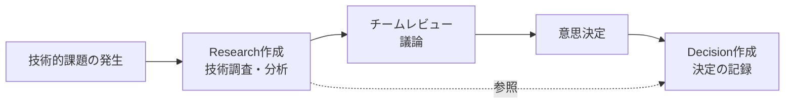

# Architecture Documentation

このディレクトリには、プロジェクトのアーキテクチャに関する技術調査と意思決定の記録を管理します。

## ドキュメント構造

```
architecture/
├── _templates/           # ドキュメントテンプレート
│   ├── research.md      # 技術調査テンプレート
│   └── decision.md      # アーキテクチャ決定記録テンプレート
├── researches/           # 技術調査レポート
│   └── YYYY-MM-DD-{topic}.md
└── decisions/            # アーキテクチャ決定記録
    └── YYYY-MM-DD-{decision}.md
```

## ドキュメントタイプの責務

### Researches - 技術調査レポート

**目的**: 技術選定や実装方法に関する詳細な調査と分析

**責務**:

- 複数の技術オプションの比較検討
- 各オプションの長所・短所の分析
- パフォーマンス、セキュリティ、保守性の評価
- 具体的な実装例とコードサンプル
- 推奨される実装パターンの提示
- 使用すべきライブラリとバージョンの明記
- 避けるべき技術やアンチパターンの警告

**作成タイミング**:

- 新しい技術スタックの導入検討時
- 既存システムの大規模リファクタリング前
- パフォーマンス改善やセキュリティ強化の調査時

**含まれる内容**:

- 問題の背景と要件定義
- 調査方法論（情報源、評価基準）
- 各オプションの詳細分析
- 比較マトリックス
- 実装パターンとベストプラクティス
- Primary Recommendation（推奨案）と代替案

### Decisions - アーキテクチャ決定記録

**目的**: プロジェクトで下されたアーキテクチャ上の決定の公式記録

**責務**:

- チームとして合意した決定の文書化
- 決定に至った背景（コンテキスト）の記録
- 決定がもたらす影響（結果）の明記
- 検討された代替案とその却下理由
- 将来の開発者への決定根拠の伝達

**作成タイミング**:

- アーキテクチャ上の重要な決定が下された時
- 技術スタックの選定が確定した時
- 設計パターンやコーディング規約が決定された時

**含まれる内容**:

- Context（背景と課題）
- Decision（決定事項）
- Consequences（ポジティブ/ネガティブな影響）
- Alternatives（検討された代替案）
- References（関連するResearchや外部資料）

## 関係性と使い分け

### 典型的なワークフロー



### 重複と差異

#### 重複する要素

- 選択された技術/ソリューション
- 選択理由の概要

#### Researchesの独自要素

- 詳細な技術仕様とバージョン情報
- 具体的な実装ガイドとコードサンプル
- 使用すべき/避けるべき技術の明確な指示
- パフォーマンスメトリクスと比較データ

#### Decisionの独自要素

- 組織としての公式な決定声明
- 簡潔で明確な決定記録
- 長期的な影響と保守性への考慮
- 決定のステータス管理（Proposed/Accepted/Deprecated/Superseded）

## ファイル命名規則

- **Research**: `researches/YYYY-MM-DD-{topic-slug}.md`
  - 例: `researches/2024-03-15-ipc-type-safety.md`
- **Decision**: `decisions/YYYY-MM-DD-{decision-slug}.md`
  - 例: `decisions/2024-03-15-use-electron-trpc.md`

## ベストプラクティス

1. **Researchesファースト**: 重要な技術決定の前には必ずResearchesで調査を行う
2. **Decisionで確定**: Researchesの推奨事項が承認されたらDecisionで正式に記録
3. **相互参照**: Decisionからは関連するResearchesを、Researchesからは結果のDecisionを参照
4. **更新管理**: 技術の変更時は新しいDecisionを作成し、古いものをSupersededに
5. **言語統一**: 技術ドキュメントは英語で記述（コードとの一貫性のため）
