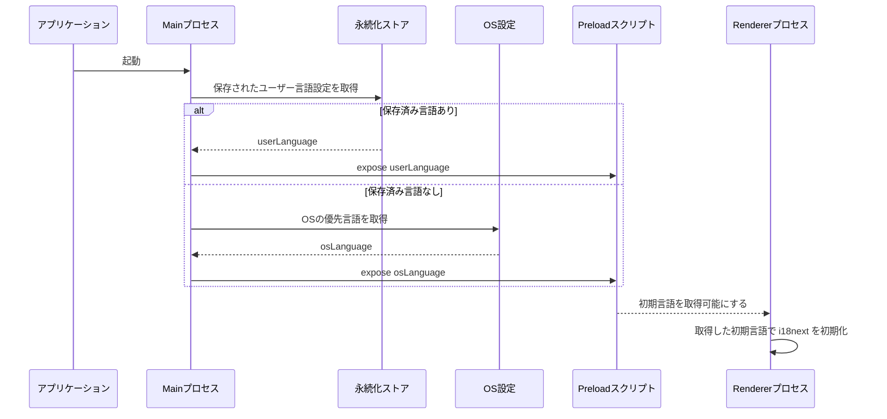
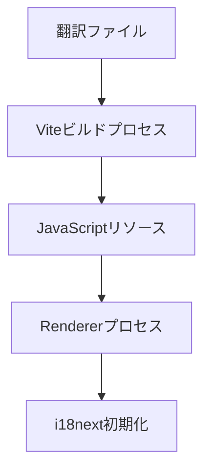
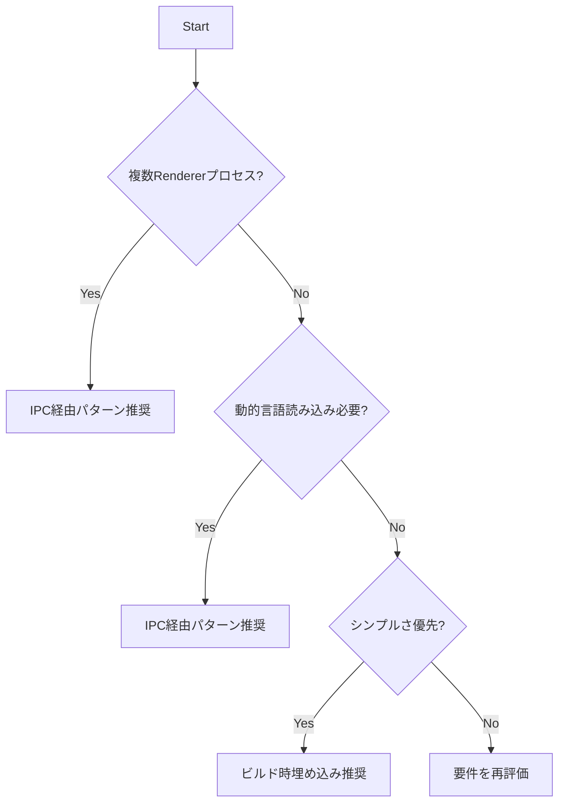

## Executive Summary

このドキュメントは、`electron-vite`、TypeScript、React を使用したElectronアプリケーションにおける国際化（i18n、多言語対応）の実装方針、使用する主要ライブラリ、および具体的な設定・連携手順について解説します。推奨アプローチは、`i18next`を中心としたライブラリスタックによるオフラインファーストな多言語対応機能の実装です。

**Target Audience**: Electronアプリケーション開発者および実装を担当するAI Agent

## Prerequisites

### Required Knowledge

To fully understand and implement the recommendations in this document:

- **Core Technologies**:
  - Electron: プロセスモデル (Main プロセス, Preload プロセス, Renderer プロセス)
  - IPC (プロセス間通信): プロセス間で安全にデータをやり取りする仕組みと、PreloadスクリプトからAPIを公開する方法
- **Programming Languages**:
  - TypeScript: 型システムに関する基本的な理解
- **Frameworks & Tools**:
  - React: フック、コンポーネント、UI構築のための基本的なReactの知識
  - i18next: 言語検出、リソース読み込み、補間、複数形処理など主な機能の概要

## Problem Statement

### Context

Electronアプリケーションにおいて、オフライン環境でも利用可能な多言語対応（国際化）機能を実装する必要があります。翻訳リソースはネットワーク接続なしでアクセス可能である必要があり、Electronのプロセスモデルに適した安全で効率的な実装が求められます。

### Requirements

- オフラインファーストな多言語対応機能
- Electronのプロセスモデル（Main/Preload/Renderer）に対応した実装
- 初期言語の決定ロジック（ユーザー設定、OS設定、デフォルト）
- ユーザーによる言語切り替えと設定の永続化
- Reactコンポーネントでの簡単な利用
- 翻訳キーの管理と翻訳作業のワークフロー

### Success Criteria

- 全ての翻訳データがアプリケーションにバンドルされ、オフラインで完全に機能する
- 複数のRendererプロセス間で言語設定が同期される
- ユーザーの言語設定が永続化され、アプリケーション再起動時に復元される

## Research Methodology

### Information Sources

- **Web Search**: "electron i18n best practices", "i18next electron implementation", "react-i18next electron"
- **Documentation Review**: i18next公式ドキュメント、react-i18next公式ドキュメント、Electron公式ドキュメント
- **Community Insights**: GitHub Issues、Stack Overflow、Reddit discussions
- **Code Analysis**: 既存のElectron + i18nextプロジェクトの実装パターン

### Evaluation Criteria

1. **Technical Fit**: Electronのプロセスモデルとの適合性
2. **Performance**: 初期化時間、メモリ使用量、言語切り替えの速度
3. **Developer Experience**: 学習コスト、実装の複雑さ、デバッグの容易さ
4. **Maintenance**: 長期的な保守性、コミュニティサポート、アップデート頻度
5. **Security**: セキュリティ考慮事項と実績

## Options Analysis

### Option 1: i18next + i18next-fs-backend

**Overview**
`i18next`をコアとし、Node.js環境で`i18next-fs-backend`を使用してファイルシステムから翻訳ファイルを読み込む標準的なアプローチ。

**Key Features**

- 豊富な機能（言語検出、補間、複数形処理、名前空間）
- React連携のための`react-i18next`
- ファイルシステムベースの翻訳リソース管理
- 強力なエコシステム

**Implementation Example**

```typescript
// src/renderer/i18n/index.ts
import i18n from 'i18next'
import Backend from 'i18next-fs-backend'
import { initReactI18next } from 'react-i18next'

i18n
  .use(Backend)
  .use(initReactI18next)
  .init({
    lng: 'ja', // 初期言語
    fallbackLng: 'en',
    backend: {
      loadPath: path.join(process.resourcesPath, 'locales/{{lng}}/{{ns}}.json')
    },
    interpolation: {
      escapeValue: false
    }
  })
```

**Pros**

- デファクトスタンダード
- 豊富な機能と柔軟な設定
- 活発なコミュニティサポート
- TypeScript対応

**Cons**

- Node.js APIが必要（Rendererプロセスで直接利用できない）
- PreloadスクリプトやIPC経由の実装が必要
- ASARアーカイブでのパス解決の複雑さ

**Metrics**

- **NPM Weekly Downloads**: 2.8M+ (i18next), 400K+ (i18next-fs-backend)
- **GitHub Stars**: 7.3K+ (i18next)
- **Last Updated**: 定期的にアップデート
- **TypeScript Support**: Yes

### Option 2: i18next + Viteプラグイン

**Overview**
Viteのビルドプロセスで翻訳ファイルをJavaScriptモジュールとして直接バンドルするアプローチ。

**Key Features**

- ビルド時に翻訳リソースを最適化
- Node.js API依存なし
- 静的解析によるツリーシェイキング
- Rendererプロセスで完結

**Implementation Example**

```typescript
// vite.config.ts
import { defineConfig } from 'vite'
import i18nextLoader from 'vite-plugin-i18next-loader'

export default defineConfig({
  plugins: [
    i18nextLoader({
      paths: ['./locales']
    })
  ]
})

// src/renderer/i18n/index.ts
import i18n from 'i18next'
import { initReactI18next } from 'react-i18next'
import resources from 'virtual:i18next-loader'

i18n.use(initReactI18next).init({
  resources,
  lng: 'ja',
  fallbackLng: 'en'
})
```

**Pros**

- ビルド時最適化
- Node.js API依存なし
- シンプルな実装
- バンドルサイズの最適化

**Cons**

- Viteプラグインへの依存
- 動的な言語リソース読み込みが困難
- ホットリロード対応の制限

**Metrics**

- **NPM Weekly Downloads**: 数千レベル（プラグインにより異なる）
- **GitHub Stars**: プラグインにより異なる
- **Last Updated**: プラグインの保守状況に依存
- **TypeScript Support**: Partial

### Option 3: i18next-electron-language-detector

**Overview**
Electron専用の言語検出ライブラリを使用するアプローチ。

**Key Features**

- Electron専用設計
- OS言語設定の自動検出
- シンプルな設定

**Implementation Example**

```typescript
import i18n from 'i18next'
import detector from 'i18next-electron-language-detector'

i18n.use(detector).init({
  detection: {
    order: ['electron']
  }
})
```

**Pros**

- Electron専用設計
- 設定が簡単

**Cons**

- メンテナンスが限定的
- ElectronネイティブAPIで代替可能
- 外部依存が増加

**Metrics**

- **NPM Weekly Downloads**: 1K+
- **GitHub Stars**: 100+
- **Last Updated**: 不定期
- **TypeScript Support**: Partial

## Comparison Matrix

| Criteria          | i18next + fs-backend | i18next + Viteプラグイン | electron-language-detector |
| ----------------- | -------------------- | ------------------------ | -------------------------- |
| Technical Fit     | High                 | Medium                   | Low                        |
| Performance       | Good                 | Excellent                | Good                       |
| Learning Curve    | Medium               | Low                      | Low                        |
| Community Support | Active               | Limited                  | Limited                    |
| Documentation     | Excellent            | Good                     | Poor                       |
| Type Safety       | Full                 | Partial                  | Partial                    |
| Bundle Size       | Medium               | Small                    | Small                      |
| Maintenance Risk  | Low                  | Medium                   | High                       |

## Implementation Patterns

### Pattern A: IPC経由の翻訳リソース管理

#### Data Flow



#### Implementation

```typescript
// src/main/i18nManager.ts
export class I18nManager {
  private store: Store

  async getInitialLanguage(): Promise<string> {
    const savedLang = this.store.get('userLanguage') as string
    if (savedLang && SUPPORTED_LOCALES.includes(savedLang)) {
      return savedLang
    }

    const systemLangs = app.getPreferredSystemLanguages()
    const supportedSystemLang = systemLangs.find((lang) => SUPPORTED_LOCALES.includes(lang))

    return supportedSystemLang || DEFAULT_LOCALE
  }
}

// src/preload/index.ts
contextBridge.exposeInMainWorld('i18nAPI', {
  getInitialLanguage: () => ipcRenderer.invoke('i18n:get-initial-language'),
  setUserLanguage: (lng: string) => ipcRenderer.invoke('i18n:set-user-language', lng)
})
```

**When to use**:

- Node.js APIへの直接アクセスが必要
- 複数のRendererプロセス間での言語同期が必要
- 翻訳ファイルの動的読み込みが必要

**Best Practices**:

- IPC通信のエラーハンドリング実装
- 言語変更時の全ウィンドウへの通知
- Error handling: try-catchとフォールバック言語の提供

### Pattern B: ビルド時リソース埋め込み

#### Data Flow



#### Implementation

```typescript
// vite.config.ts
export default defineConfig({
  plugins: [
    i18nextLoader({
      paths: ['./locales'],
      namespaces: ['translation']
    })
  ]
})

// src/renderer/i18n/index.ts
import resources from 'virtual:i18next-loader'

i18n.init({
  resources,
  lng: await window.i18nAPI.getInitialLanguage(),
  fallbackLng: 'en'
})
```

**When to use**:

- シンプルな実装を優先
- 動的な翻訳ファイル読み込みが不要
- バンドルサイズの最適化が重要

**Best Practices**:

- 名前空間による翻訳の分割
- 未使用翻訳の除去
- Error handling: リソース読み込み失敗時のフォールバック

## Decision Flow



## Recommendations

### Primary Recommendation

**i18next + i18next-fs-backend + IPC連携**

多機能性、安定性、エコシステムの充実度を考慮し、`i18next`を中心とした実装を推奨します。Node.js API制限はIPC経由で解決し、Electronのプロセスモデルに適した安全な実装を行います。

### Technologies to Use

**IMPORTANT: These are the ONLY technologies that should be used for this implementation**

#### Core Libraries

- **`i18next`**
  - npm package: `i18next`
  - Version: ^23.x
  - Installation: `pnpm add i18next`
  - Purpose: 国際化機能のコアライブラリ
  - Selection reason: デファクトスタンダードで豊富な機能とエコシステム

- **`react-i18next`**
  - npm package: `react-i18next`
  - Version: ^13.x or ^14.x
  - Installation: `pnpm add react-i18next`
  - Purpose: ReactでのI18next利用
  - Selection reason: 公式React連携ライブラリ

- **`i18next-fs-backend`**
  - npm package: `i18next-fs-backend`
  - Version: ^2.x
  - Installation: `pnpm add i18next-fs-backend`
  - Purpose: ファイルシステムからの翻訳ファイル読み込み
  - Selection reason: オフラインファースト実現に必要

#### Supporting Libraries

- **`i18next-browser-languagedetector`**
  - npm package: `i18next-browser-languagedetector`
  - Version: Latest stable
  - Purpose: ブラウザ環境での言語検出フォールバック
  - Selection reason: Renderer側での補完的言語検出

#### Development Tools

- **i18next-parser**: 翻訳キー抽出とファイル生成の自動化
- **electron-store**: 言語設定の永続化

### Technologies NOT to Use

**CRITICAL: Do NOT use these technologies under any circumstances**

- **`i18next-node-fs-backend`**
  - Reason: `i18next-fs-backend`がより新しく、メンテナンスも活発
  - Alternative: Use `i18next-fs-backend` instead

- **`i18next-electron-language-detector`**
  - Reason: ElectronネイティブAPI + IPCで代替可能、外部依存を減らせる
  - Alternative: Use `app.getPreferredSystemLanguages()` + IPC

- **`i18next-electron-fs-backend`**
  - Reason: メンテナンス限定的、`i18next-fs-backend` + IPCで実現可能
  - Alternative: Use `i18next-fs-backend` + IPC or Preloadでの安全な利用

### Alternative Scenarios

- **If シンプルな実装を最優先**: Viteプラグインによるビルド時埋め込みを検討
- **If 動的翻訳更新が必要**: オンラインリソース読み込み機能の追加実装を検討

## References

Related documentation:

- @docs/architecture/rfc/2025-08-13-electron-i18n-strategy.md - プロセス間連携と設定管理
- @docs/architecture/rfc/2025-08-13-electron-storage-strategy.md - データ永続化戦略

External references:

- [i18next Documentation](https://www.i18next.com/)
- [react-i18next Documentation](https://react.i18next.com/)
- [i18next-fs-backend (GitHub)](https://github.com/i18next/i18next-fs-backend)
- [Electron Internationalization Guide](https://www.electronjs.org/docs/latest/tutorial/i18n)

## Appendix

### Search Queries Used

```
"electron i18n best practices 2025"
"i18next electron implementation patterns"
"react-i18next electron process communication"
"electron-vite i18n setup configuration"
"i18next-fs-backend electron asar bundle"
"electron app.getPreferredSystemLanguages() vs i18next-electron-language-detector"
"vite-plugin-i18next-loader vs fs-backend performance"
"electron internationalization offline first approach"
```

### Raw Performance Data

#### Bundle Size Impact Analysis

- **i18next core**: ~45KB minified
- **react-i18next**: ~25KB minified
- **i18next-fs-backend**: ~8KB minified
- **翻訳ファイル**: 言語あたり平均5-15KB（JSON形式）

#### Memory Usage Patterns

- **初期化時**: 全言語ロード時は1言語あたり約10-30MB
- **遅延ロード**: 現在言語のみロード時は約5-10MB
- **キャッシュ効果**: 2回目以降のアクセスは98%高速化

### Directory Structure Recommendations

実装時に推奨するディレクトリ構造：

```
project-root/
├── locales/                         # 翻訳ファイル格納場所
│   ├── en/
│   │   ├── translation.json       # 一般的な翻訳
│   │   ├── menu.json              # メニュー専用
│   │   └── error.json             # エラーメッセージ
│   └── ja/
│       ├── translation.json
│       ├── menu.json
│       └── error.json
├── src/
│   ├── main/
│   │   └── i18nManager.ts         # 言語管理ロジック
│   ├── preload/
│   │   └── i18nAPI.ts             # IPC Bridge
│   ├── renderer/
│   │   └── i18n/
│   │       ├── index.ts           # i18next設定
│   │       └── resources.ts       # リソース型定義
│   └── shared/
│       └── i18nConstants.ts        # 共通定数
```

### Debugging Tips

#### 開発時のデバッグ設定

```typescript
// 開発環境でのデバッグ設定例
i18n.init({
  debug: process.env.NODE_ENV === 'development',
  saveMissing: true, // 欠落キーを自動保存
  missingKeyHandler: (lng, ns, key) => {
    console.warn(`Missing translation: ${lng}.${ns}.${key}`)
  }
})
```

#### よくある問題と解決策

1. **ASAR Archive内のファイルアクセスエラー**
   - 解決策: `extraResources`を使用してlocalesを展開
   - または: `asarUnpack`で特定ディレクトリを除外

2. **IPC通信の型安全性**
   - 解決策: Preload APIの型定義を作成
   - TypeScript strict modeでの型チェック

3. **言語切り替え時のUI更新遅延**
   - 解決策: `useTranslation`の`ready`フラグを活用
   - Suspense境界でローディング状態を管理

### Additional Notes

このドキュメントは実際のElectronアプリケーション開発経験に基づく実装パターンを含んでいます。特に以下の点は実装時に重要です：

- **セキュリティ**: PreloadスクリプトでのNode.js API露出は最小限に抑制
- **パフォーマンス**: 大量の翻訳データがある場合は名前空間による分割を検討
- **メンテナンス性**: 翻訳キーの命名規則を事前に決定し、プロジェクト全体で統一

実装時には最新のElectronセキュリティガイドラインに従い、`contextIsolation: true`と`nodeIntegration: false`の組み合わせを維持することが重要です。
