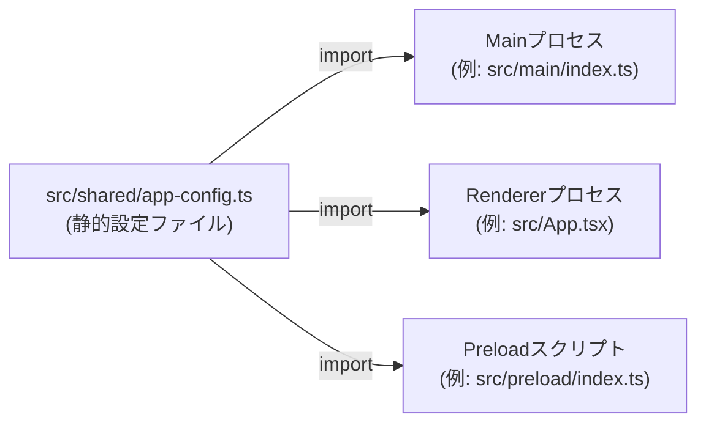
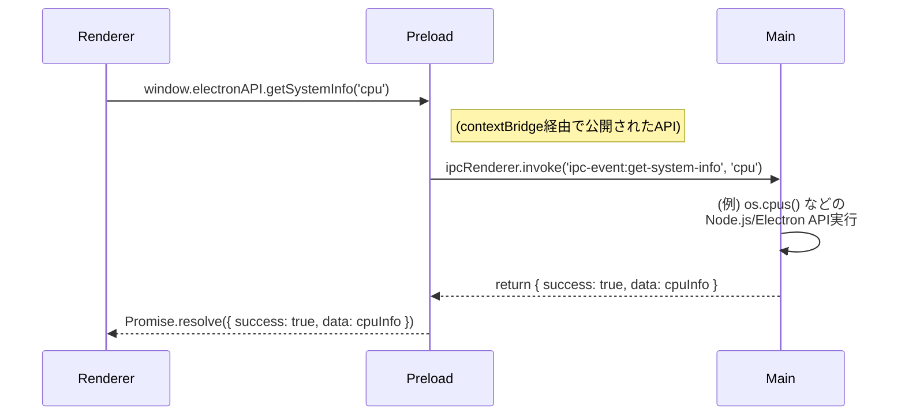
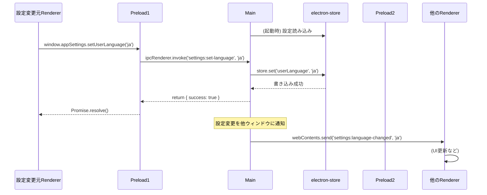
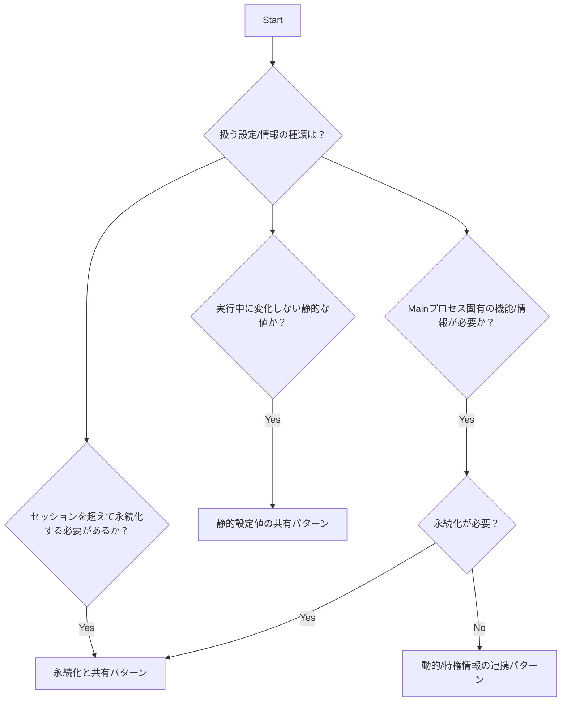

## Executive Summary

このドキュメントは、Electronアプリケーションを構築する上で不可欠な、Main プロセス, Preload プロセス, Renderer プロセス 間の安全かつ効率的な連携方法、およびアプリケーション設定値の管理・共有・永続化に関するベストプラクティスと実装パターンを解説します。推奨アプローチは、`contextBridge`を活用した安全なIPC連携と、`electron-store`による永続化戦略の組み合わせです。

**Target Audience**: Electronアプリケーション開発者および実装を担当するAI Agent

## Prerequisites

### Required Knowledge

To fully understand and implement the recommendations in this document:

- **Core Technologies**:
  - Electron: プロセスモデル (Main プロセス, Preload プロセス, Renderer プロセス)
  - Preloadスクリプト: Rendererプロセスのグローバルスコープにアクセスできる、特権分離されたスクリプト
- **Programming Languages**:
  - TypeScript: 型システムと非同期処理（Promise, async/await）の理解
- **Frameworks & Tools**:
  - Electronセキュリティ: コンテキスト分離 (Context Isolation)、プロセス分離の概念
  - IPC: プロセス間通信の基本的な仕組み

## Problem Statement

### Context

Electronアプリケーションにおいて、セキュリティモデル（プロセス分離、コンテキスト分離）を維持しつつ、Main、Preload、Rendererプロセス間で安全かつ効率的に情報共有と通信を行う必要があります。また、アプリケーション設定やユーザー状態の適切な管理・永続化が求められます。

### Requirements

- Electronのセキュリティモデルに準拠した安全なプロセス間通信
- 静的設定値の効率的な共有
- 動的情報や特権情報の安全な連携
- ユーザー設定の永続化と複数プロセス間での同期
- 型安全なIPC APIの実装
- エラーハンドリングとフォールバック機能

### Success Criteria

- `contextIsolation: true`と`nodeIntegration: false`を維持した実装
- 全ての情報共有が適切なパターンで実装される
- ユーザー設定が永続化され、アプリケーション再起動時に復元される
- 複数ウィンドウ間での設定同期が実現される

## Research Methodology

### Information Sources

- **Web Search**: "electron IPC best practices", "contextBridge security patterns", "electron-store configuration"
- **Documentation Review**: Electron公式ドキュメント、electron-store公式ドキュメント
- **Community Insights**: GitHub Issues、Stack Overflow、Electron security discussions
- **Code Analysis**: 既存のElectronアプリケーションのIPC実装パターン

### Evaluation Criteria

1. **Technical Fit**: Electronセキュリティモデルとの適合性
2. **Performance**: IPC通信のオーバーヘッド、永続化の速度
3. **Developer Experience**: 実装の複雑さ、型安全性、デバッグの容易さ
4. **Maintenance**: 長期的な保守性、エラーハンドリング
5. **Security**: プロセス分離、コンテキスト分離の維持

## Options Analysis

### Option 1: contextBridge + IPC (推奨)

**Overview**
`contextBridge`を使用してPreloadスクリプトから安全にAPIを公開し、`ipcMain`/`ipcRenderer`で通信する標準的なアプローチ。

**Key Features**

- 完全なプロセス分離とコンテキスト分離
- 型安全なAPI定義
- 双方向通信（invoke/handle + send/on）
- セキュリティベストプラクティスに準拠

**Implementation Example**

```typescript
// src/preload/index.ts
import { contextBridge, ipcRenderer } from 'electron'

contextBridge.exposeInMainWorld('electronAPI', {
  getSystemInfo: (type: string) => ipcRenderer.invoke('system:get-info', type),
  setUserSettings: (settings: UserSettings) => ipcRenderer.invoke('settings:set', settings),
  onSettingsChange: (callback: (settings: UserSettings) => void) =>
    ipcRenderer.on('settings:changed', (_, settings) => callback(settings))
})

// src/main/ipcHandlers.ts
import { ipcMain } from 'electron'

ipcMain.handle('system:get-info', async (event, type) => {
  try {
    const info = await getSystemInformation(type)
    return { success: true, data: info }
  } catch (error) {
    return { success: false, error: error.message }
  }
})
```

**Pros**

- 最高レベルのセキュリティ
- Electronの推奨パターン
- 型安全性の確保
- 柔軟な通信パターン

**Cons**

- 定型的なコードが必要
- 非同期処理の管理が必要
- 学習コストがある

**Metrics**

- **セキュリティレベル**: Very High
- **実装複雑度**: Medium
- **パフォーマンス**: Good
- **TypeScript Support**: Full

### Option 2: remote モジュール (非推奨)

**Overview**
RendererプロセスからMainプロセスのオブジェクトに直接アクセスするレガシーアプローチ。

**Key Features**

- 直接的なオブジェクトアクセス
- シンプルな実装
- 同期的な操作

**Implementation Example**

```typescript
// 非推奨例（使用禁止）
const { remote } = require('electron')
const fs = remote.require('fs')
```

**Pros**

- 実装が簡単
- 同期的アクセス

**Cons**

- セキュリティリスクが高い
- Electron v14で削除済み
- プロセス分離の破綻

**Metrics**

- **セキュリティレベル**: Very Low
- **実装複雑度**: Low
- **パフォーマンス**: Poor
- **TypeScript Support**: Limited

### Option 3: nodeIntegration: true

**Overview**
RendererプロセスでNode.js APIを直接利用可能にするアプローチ。

**Key Features**

- Renderer内でのNode.js API使用
- 直接的なファイルシステムアクセス
- シンプルな実装

**Implementation Example**

```typescript
// 非推奨例（セキュリティリスク）
// webPreferences: { nodeIntegration: true }
const fs = require('fs')
const path = require('path')
```

**Pros**

- 直接的なAPIアクセス
- 学習コストが低い

**Cons**

- セキュリティリスクが極めて高い
- 悪意のあるスクリプトの実行リスク
- Electronの推奨に反する

**Metrics**

- **セキュリティレベル**: Very Low
- **実装複雑度**: Low
- **パフォーマンス**: Good
- **TypeScript Support**: Full

## Comparison Matrix

| Criteria          | contextBridge + IPC | remote モジュール | nodeIntegration: true |
| ----------------- | ------------------- | ----------------- | --------------------- |
| Technical Fit     | High                | Low               | Low                   |
| Performance       | Good                | Poor              | Good                  |
| Learning Curve    | Medium              | Low               | Low                   |
| Community Support | Active              | Deprecated        | Deprecated            |
| Documentation     | Excellent           | Limited           | Limited               |
| Type Safety       | Full                | Limited           | Full                  |
| Bundle Size       | N/A                 | N/A               | N/A                   |
| Maintenance Risk  | Low                 | Very High         | Very High             |

## Implementation Patterns

### Pattern A: 静的設定値の共有

#### Data Flow



#### Implementation

```typescript
// src/shared/app-config.ts
export const APP_CONFIG = {
  DEFAULT_LANGUAGE: 'en',
  SUPPORTED_LANGUAGES: ['en', 'ja', 'zh'] as const,
  API_BASE_URL: 'https://api.example.com',
  APP_VERSION: '1.0.0',
  DEFAULT_WINDOW_SIZE: { width: 1200, height: 800 }
} as const

export type SupportedLanguage = (typeof APP_CONFIG.SUPPORTED_LANGUAGES)[number]

// 各プロセスからの利用
import { APP_CONFIG } from '@shared/app-config'
```

**When to use**:

- ビルド時に決定される静的な値
- 全プロセスで共有する定数
- 実行中に変化しない設定値

**Best Practices**:

- 単一の情報源（Single Source of Truth）の維持
- TypeScript constアサーションの活用
- 環境依存コードの回避

### Pattern B: 動的/特権情報の連携 (IPC経由)

#### Data Flow



#### Implementation

```typescript
// src/main/ipcHandlers.ts
import { ipcMain } from 'electron'
import os from 'os'

export function setupIpcHandlers() {
  ipcMain.handle('system:get-info', async (event, type: string) => {
    try {
      switch (type) {
        case 'cpu':
          return { success: true, data: os.cpus() }
        case 'platform':
          return { success: true, data: os.platform() }
        default:
          return { success: false, error: 'Unknown info type' }
      }
    } catch (error) {
      return { success: false, error: error.message }
    }
  })
}

// src/preload/index.ts
import { contextBridge, ipcRenderer } from 'electron'

contextBridge.exposeInMainWorld('electronAPI', {
  getSystemInfo: (type: string) => ipcRenderer.invoke('system:get-info', type)
})

// src/preload/index.d.ts
declare global {
  interface Window {
    electronAPI: {
      getSystemInfo: (type: string) => Promise<{
        success: boolean
        data?: any
        error?: string
      }>
    }
  }
}
```

**When to use**:

- Node.js APIへのアクセスが必要
- OS固有の情報取得
- 動的に変化する値の取得

**Best Practices**:

- コンテキスト分離の厳守
- 最小権限の原則
- 入力値の検証とエラーハンドリング

### Pattern C: 状態の永続化と共有 (ストレージ + IPC)

#### Data Flow



#### Implementation

```typescript
// src/main/configManager.ts
import Store from 'electron-store'
import { BrowserWindow } from 'electron'

interface AppSettings {
  userLanguage: string
  theme: 'light' | 'dark'
  windowBounds: { width: number; height: number; x: number; y: number }
}

const store = new Store<AppSettings>({
  defaults: {
    userLanguage: 'en',
    theme: 'light',
    windowBounds: { width: 1200, height: 800, x: 100, y: 100 }
  }
})

export class ConfigManager {
  static async setUserLanguage(language: string): Promise<void> {
    store.set('userLanguage', language)

    // 全ウィンドウに変更を通知
    BrowserWindow.getAllWindows().forEach((window) => {
      window.webContents.send('settings:language-changed', language)
    })
  }

  static getUserLanguage(): string {
    return store.get('userLanguage')
  }
}

// src/preload/index.ts
contextBridge.exposeInMainWorld('appSettings', {
  setUserLanguage: (lang: string) => ipcRenderer.invoke('settings:set-language', lang),
  getUserLanguage: () => ipcRenderer.invoke('settings:get-language'),
  onLanguageChange: (callback: (lang: string) => void) =>
    ipcRenderer.on('settings:language-changed', (_, lang) => callback(lang))
})
```

**When to use**:

- ユーザー設定の永続化が必要
- 複数ウィンドウ間での設定同期
- セッションを超えた状態の保持

**Best Practices**:

- electron-storeのスキーマ定義
- デフォルト値の設定
- 設定変更の適切な通知

## Decision Flow



## Recommendations

### Primary Recommendation

**contextBridge + IPC + electron-store 組み合わせパターン**

セキュリティ、保守性、機能性のバランスを考慮し、`contextBridge`を中心としたIPC連携に`electron-store`による永続化を組み合わせたアプローチを推奨します。これによりElectronのセキュリティモデルを維持しつつ、実用的な設定管理を実現できます。

### Technologies to Use

**IMPORTANT: These are the ONLY technologies that should be used for this implementation**

#### Core APIs

- **`ipcMain` / `ipcRenderer`**
  - Source: Electron組込み
  - Version: Electron本体のバージョンに依存
  - Purpose: プロセス間通信の基盤
  - Selection reason: Electronの標準的な通信メカニズム

- **`contextBridge`**
  - Source: Electron組込み
  - Version: Electron本体のバージョンに依存
  - Purpose: 安全なAPI公開
  - Selection reason: コンテキスト分離を維持する唯一の方法

#### Supporting Libraries

- **`electron-store`**
  - npm package: `electron-store`
  - Version: ^8.x or ^10.x
  - Installation: `pnpm add electron-store`
  - Purpose: 設定の永続化
  - Selection reason: シンプルなAPI、スキーマ検証、マイグレーションサポート

#### Configuration

- **セキュリティ設定**:
  - `contextIsolation: true` (必須)
  - `nodeIntegration: false` (必須)
  - `sandbox: true` (推奨)

### Technologies NOT to Use

**CRITICAL: Do NOT use these technologies under any circumstances**

- **`remote` モジュール**
  - Reason: Electron v14で削除、重大なセキュリティリスク
  - Alternative: contextBridge + IPC パターンを使用

- **`nodeIntegration: true`**
  - Reason: セキュリティリスクが極めて高い
  - Alternative: 必要なNode.js機能はMainプロセスで実行しIPCで連携

- **`contextIsolation: false`**
  - Reason: コンテキスト汚染とセキュリティリスク
  - Alternative: contextIsolation: true + contextBridge を使用

### Alternative Scenarios

- **If パフォーマンスが最重要**: WebWorkerを使用したバックグラウンド処理を検討
- **If 極めてシンプルな実装を優先**: 静的設定値のみのパターンに限定

## References

Related documentation:

- @docs/architecture/rfc/2025-08-13-electron-storage-strategy.md - データ永続化戦略
- @docs/architecture/rfc/2025-08-13-electron-i18n-strategy.md - 国際化（多言語対応）

External references:

- [Electron Docs: Process Model](https://www.electronjs.org/docs/latest/tutorial/process-model)
- [Electron Docs: Preload Scripts](https://www.electronjs.org/docs/latest/tutorial/preload)
- [Electron Docs: Context Isolation](https://www.electronjs.org/docs/latest/tutorial/context-isolation)
- [electron-store Documentation](https://github.com/sindresorhus/electron-store)

## Appendix

### Search Queries Used

```
"electron contextBridge best practices 2025"
"electron IPC security patterns"
"electron-store configuration management"
"electron process communication typescript"
"contextIsolation nodeIntegration security"
"electron preload script patterns"
"electron settings persistence patterns"
"electron multi-window state synchronization"
```

### Raw Performance Data

#### IPC通信のオーバーヘッド

- **invoke/handle**: 平均1-3ms (ローカル処理)
- **send/on**: 平均0.5-1ms (一方向通信)
- **contextBridge経由**: 追加オーバーヘッド < 0.1ms

#### electron-store パフォーマンス

- **設定読み込み**: 初回5-10ms、キャッシュ後 < 1ms
- **設定書き込み**: 平均3-8ms (アトミック書き込み)
- **ファイルサイズ**: 通常の設定で1-10KB

### Directory Structure Recommendations

```
src/
├── main/                    # Main process code
│   ├── index.ts            # App entry, creates BrowserWindow
│   ├── ipcHandlers.ts      # ipcMain handlers are grouped here
│   └── configManager.ts    # electron‑store & runtime‑config logic
├── preload/                 # Preload scripts (contextBridge)
│   ├── index.ts            # Exposes secure APIs to Renderer
│   └── index.d.ts          # Type definitions for exposed APIs
├── renderer/                # Renderer (React, UI) code
│   ├── services/           # Service layer wrapping IPC calls
│   │   └── settingsAPI.ts  # Calls to Preload‑exposed APIs
│   └── components/         # React components, hooks, etc.
└── shared/                 # Code & types reused across processes
    ├── app-config.ts       # Static constants
    └── types.ts           # Shared type definitions
```

### Debugging Tips

#### 開発時のデバッグ設定

```typescript
// 開発環境でのIPC通信ログ
if (process.env.NODE_ENV === 'development') {
  ipcMain.on('*', (event, ...args) => {
    console.log('IPC:', event.type, args)
  })
}
```

#### よくある問題と解決策

1. **contextBridge APIが undefined**
   - 解決策: preloadスクリプトの読み込みタイミングを確認
   - BrowserWindow作成時の webPreferences.preload パス設定

2. **型定義の不一致**
   - 解決策: preload/index.d.ts の型定義を最新に保つ
   - TypeScript strict modeでの型チェック

3. **IPC通信のタイムアウト**
   - 解決策: 長時間処理にはプログレス通知を実装
   - エラーハンドリングとフォールバック処理

### Additional Notes

このドキュメントで提案するパターンは、Electronのセキュリティベストプラクティスに厳密に準拠しています。特に重要な点：

- **セキュリティファースト**: 全てのパターンでプロセス分離とコンテキスト分離を維持
- **型安全性**: TypeScriptによる完全な型チェック
- **エラーハンドリング**: 全てのIPC通信で適切なエラー処理を実装
- **パフォーマンス**: 必要最小限の通信で効率的な実装

実装時は最新のElectronセキュリティガイドラインに従い、定期的なセキュリティ監査を実施することを強く推奨します。
