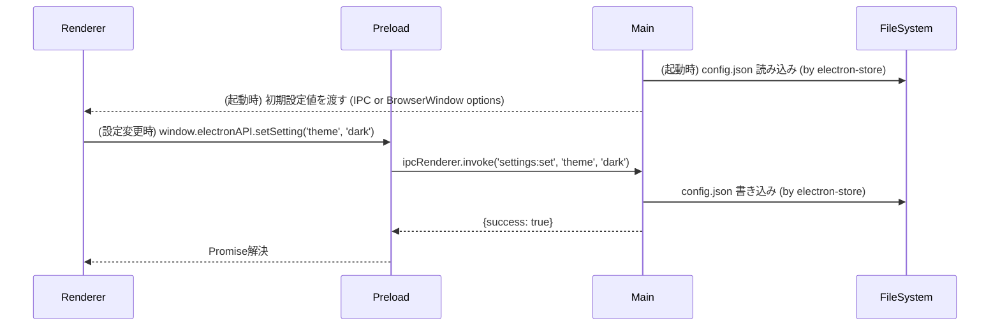
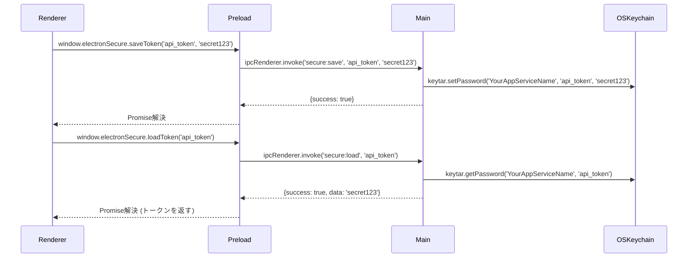
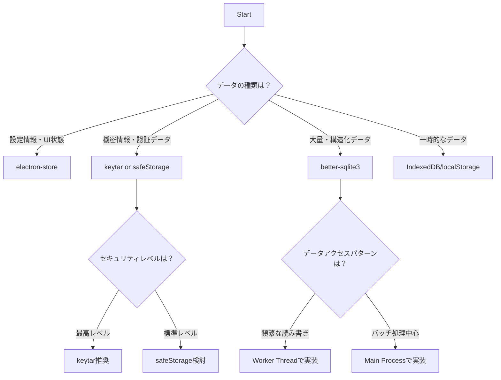

## Executive Summary

このドキュメントは、Electronアプリケーションにおけるデータ永続化の選択肢とベストプラクティスについて、包括的な指針を提供します。データの種類、セキュリティ要件、パフォーマンス、将来の運用（同期・移行など）を考慮し、最適な永続化手段を選択・実装できるようになることを目指します。

**Target Audience**: Electronアプリケーション開発者および実装を担当するAI Agent

## Prerequisites

### Required Knowledge

To fully understand and implement the recommendations in this document:

- **Core Technologies**:
  - プロセスモデル (Main, Renderer, Preload): Electronアプリケーションの基本的な動作構造
  - IPC (プロセス間通信): 各プロセス間でデータを安全にやり取りする仕組み
- **Programming Languages**:
  - 非同期処理 (Promise, async/await): Node.js環境でのノンブロッキングI/Oの基本
- **Frameworks & Tools**:
  - JSON: データ交換形式として広く利用される
  - RDB (リレーショナルデータベース) / NoSQL の基本概念: データベースの基本的な考え方

## Problem Statement

### Context

Electronアプリケーションにおいて、データの種類や要件に応じた適切な永続化手段の選択と実装が課題となっています。アプリ設定、機密情報、大量の構造化データ、一時データなど、異なる特性を持つデータを最適な方法で管理する必要があります。

### Requirements

- 様々なデータ種類（設定、機密情報、構造化データ、一時データ）への対応
- Electronのプロセスモデルに適した安全で効率的な実装
- セキュリティ、パフォーマンス、データ移行の考慮
- OSの適切なディレクトリへのデータ保存
- 将来の機能拡張や同期要件への対応

### Success Criteria

- データ種類に応じた最適な永続化手段の選択と実装
- セキュリティベストプラクティスの遵守
- パフォーマンスを考慮した効率的なデータアクセス
- データの整合性と耐久性の確保

## Research Methodology

### Information Sources

- **Documentation Review**: electron-store、better-sqlite3、keytar、safeStorage公式ドキュメント
- **Community Insights**: GitHub Issues、実装パターンの調査
- **Code Analysis**: 既存のElectronアプリケーションでの実装事例

### Evaluation Criteria

1. **Technical Fit**: Electronのプロセスモデルとの適合性
2. **Performance**: データアクセス速度、メモリ使用量
3. **Developer Experience**: 実装の複雑さ、デバッグの容易さ
4. **Maintenance**: 長期的な保守性、コミュニティサポート
5. **Security**: セキュリティ考慮事項と実績

## Options Analysis

### Option 1: electron-store による Key-Valueストレージ

**Overview**
設定情報や小規模データのJSONファイル保存。スキーマ検証、マイグレーション機能を提供。

**Key Features**

- JSONベースの設定ファイル管理
- スキーマ検証とマイグレーション機能
- Electronの`userData`パスに自動保存
- 暗号化オプション

**Implementation Example**

```typescript
// Main Process
import Store from 'electron-store'

const store = new Store({
  name: 'config',
  defaults: {
    theme: 'light',
    windowSize: { width: 1200, height: 800 }
  }
})

// IPC Handler
ipcMain.handle('settings:get', (event, key) => {
  return store.get(key)
})

ipcMain.handle('settings:set', (event, key, value) => {
  store.set(key, value)
  return { success: true }
})
```

**Pros**

- 設定管理に最適化されたAPI
- スキーマ検証とマイグレーション
- 軽量で高速
- 暗号化サポート

**Cons**

- 大量データには不向き
- 同期的なファイルI/O
- 構造化クエリ不可

**Metrics**

- **NPM Weekly Downloads**: 400K+
- **GitHub Stars**: 4.2K+
- **Last Updated**: 定期的
- **TypeScript Support**: Yes

### Option 2: keytar によるセキュアストレージ

**Overview**
OSのキーチェーン/認証情報ストレージへ直接アクセスし、機密情報を安全に保存。

**Key Features**

- OSレベルでの暗号化
- キーチェーンAPIの利用
- パスワード、トークンなどの機密情報に最適
- クロスプラットフォーム対応

**Implementation Example**

```typescript
// Main Process
import keytar from 'keytar'

const SERVICE_NAME = 'YourAppName'

// IPC Handlers
ipcMain.handle('secure:save', async (event, key, value) => {
  try {
    await keytar.setPassword(SERVICE_NAME, key, value)
    return { success: true }
  } catch (error) {
    return { success: false, error: error.message }
  }
})

ipcMain.handle('secure:load', async (event, key) => {
  try {
    const value = await keytar.getPassword(SERVICE_NAME, key)
    return { success: true, data: value }
  } catch (error) {
    return { success: false, error: error.message }
  }
})
```

**Pros**

- 最高レベルのセキュリティ
- OSネイティブの暗号化
- 機密情報管理に特化
- 堅牢なアクセス制御

**Cons**

- ネイティブモジュール依存
- ビルド時の複雑さ
- 大容量データには不向き

**Metrics**

- **NPM Weekly Downloads**: 250K+
- **GitHub Stars**: 2.8K+
- **Last Updated**: 定期的
- **TypeScript Support**: Partial

### Option 3: better-sqlite3 による構造化データ管理

**Overview**
軽量なファイルベースSQLデータベース。大量の構造化データの保存・検索に最適。

**Key Features**

- 高速な同期API
- 軽量なSQLiteエンジン
- トランザクション、インデックス対応
- ファイルベースで可搬性が高い

**Implementation Example**

```typescript
// Main Process
import Database from 'better-sqlite3'
import { app } from 'electron'
import path from 'path'

const dbPath = path.join(app.getPath('userData'), 'app.sqlite')
const db = new Database(dbPath)

// Initialize tables
db.exec(`
  CREATE TABLE IF NOT EXISTS items (
    id INTEGER PRIMARY KEY AUTOINCREMENT,
    name TEXT NOT NULL,
    created_at DATETIME DEFAULT CURRENT_TIMESTAMP
  )
`)

// Prepared statements for performance
const insertItem = db.prepare('INSERT INTO items (name) VALUES (?)')
const selectAllItems = db.prepare('SELECT * FROM items ORDER BY created_at DESC')

// IPC Handlers
ipcMain.handle('db:add-item', (event, data) => {
  try {
    const result = insertItem.run(data.name)
    return { success: true, id: result.lastInsertRowid }
  } catch (error) {
    return { success: false, error: error.message }
  }
})

ipcMain.handle('db:get-items', (event) => {
  try {
    const items = selectAllItems.all()
    return { success: true, data: items }
  } catch (error) {
    return { success: false, error: error.message }
  }
})
```

**Pros**

- 高速な同期API
- 豊富なSQL機能
- トランザクション対応
- 軽量で高性能

**Cons**

- 同期APIによるブロッキング
- Worker Thread推奨
- SQL知識が必要

**Metrics**

- **NPM Weekly Downloads**: 900K+
- **GitHub Stars**: 5.4K+
- **Last Updated**: 定期的
- **TypeScript Support**: Yes

## Comparison Matrix

| Criteria          | electron-store  | keytar          | better-sqlite3 |
| ----------------- | --------------- | --------------- | -------------- |
| Technical Fit     | High (設定管理) | High (機密情報) | High (構造化)  |
| Performance       | Good            | Medium          | Excellent      |
| Learning Curve    | Low             | Medium          | Medium         |
| Community Support | Active          | Active          | Active         |
| Documentation     | Excellent       | Good            | Good           |
| Type Safety       | Full            | Partial         | Full           |
| Bundle Size       | Small           | Medium          | Medium         |
| Maintenance Risk  | Low             | Medium          | Low            |

## Implementation Patterns

### Pattern A: 設定管理パターン (electron-store)

#### Data Flow



#### Implementation

```typescript
// src/main/configManager.ts
import Store from 'electron-store'
import { ipcMain } from 'electron'

const store = new Store({
  name: 'app-config',
  defaults: {
    theme: 'light',
    language: 'en',
    windowBounds: { width: 1200, height: 800 }
  },
  schema: {
    theme: { type: 'string', enum: ['light', 'dark'] },
    language: { type: 'string' },
    windowBounds: {
      type: 'object',
      properties: {
        width: { type: 'number' },
        height: { type: 'number' }
      }
    }
  }
})

// IPC Handlers
ipcMain.handle('config:get', (event, key) => {
  return store.get(key)
})

ipcMain.handle('config:set', (event, key, value) => {
  store.set(key, value)
  return { success: true }
})

// src/preload/index.ts
contextBridge.exposeInMainWorld('configAPI', {
  get: (key: string) => ipcRenderer.invoke('config:get', key),
  set: (key: string, value: any) => ipcRenderer.invoke('config:set', key, value)
})
```

**When to use**:

- アプリケーション設定
- UI状態の永続化
- 小規模なキャッシュデータ
- 頻繁ではない読み書き

**Best Practices**:

- スキーマ検証の実装
- マイグレーション機能の活用
- Error handling: try-catchとフォールバック値の提供

### Pattern B: 機密情報管理パターン (keytar)

#### Data Flow



#### Implementation

```typescript
// src/main/secureManager.ts
import keytar from 'keytar'
import { ipcMain } from 'electron'

const SERVICE_NAME = 'YourAppName'

class SecureManager {
  async saveCredential(key: string, value: string): Promise<boolean> {
    try {
      await keytar.setPassword(SERVICE_NAME, key, value)
      return true
    } catch (error) {
      console.error('Failed to save credential:', error)
      return false
    }
  }

  async loadCredential(key: string): Promise<string | null> {
    try {
      return await keytar.getPassword(SERVICE_NAME, key)
    } catch (error) {
      console.error('Failed to load credential:', error)
      return null
    }
  }

  async deleteCredential(key: string): Promise<boolean> {
    try {
      return await keytar.deletePassword(SERVICE_NAME, key)
    } catch (error) {
      console.error('Failed to delete credential:', error)
      return false
    }
  }
}

const secureManager = new SecureManager()

// IPC Handlers
ipcMain.handle('secure:save', async (event, key, value) => {
  const success = await secureManager.saveCredential(key, value)
  return { success }
})

ipcMain.handle('secure:load', async (event, key) => {
  const data = await secureManager.loadCredential(key)
  return { success: data !== null, data }
})

ipcMain.handle('secure:delete', async (event, key) => {
  const success = await secureManager.deleteCredential(key)
  return { success }
})
```

**When to use**:

- APIトークン、認証情報
- パスワード、シークレットキー
- OAuthリフレッシュトークン
- 高いセキュリティが必要な情報

**Best Practices**:

- サービス名とアカウント名の一貫性
- 適切なエラーハンドリング
- electron-rebuildの実行

## Decision Flow



## Recommendations

### Primary Recommendation

**パターン別アプローチ**

データの種類と要件に応じて適切な永続化手段を組み合わせて使用することを推奨します。

### Technologies to Use

**IMPORTANT: These are the ONLY technologies that should be used for this implementation**

#### Core Libraries

- **`electron-store`**
  - npm package: `electron-store`
  - Version: ^10.x
  - Installation: `pnpm add electron-store`
  - Purpose: アプリケーション設定とUI状態の管理
  - Selection reason: Electron専用設計、豊富な機能、活発な開発

- **`keytar`**
  - npm package: `keytar`
  - Version: ^7.9.0
  - Installation: `pnpm add keytar`
  - Purpose: 機密情報の安全な保存
  - Selection reason: OSレベルの暗号化、高いセキュリティ

- **`better-sqlite3`**
  - npm package: `better-sqlite3`
  - Version: ^11.x
  - Installation: `pnpm add better-sqlite3`
  - Purpose: 構造化データの高速アクセス
  - Selection reason: 高性能、軽量、豊富なSQL機能

#### Supporting Libraries

- **`prisma`** または **`typeorm`**
  - Purpose: SQLite ORM（複雑なデータモデルの場合）
  - Selection reason: 型安全性とマイグレーション管理

#### Development Tools

- **electron-rebuild**: ネイティブモジュールの再ビルド
- **sqlite3**: SQLiteデータベース管理ツール

### Technologies NOT to Use

**CRITICAL: Do NOT use these technologies under any circumstances**

- **`conf` / `lowdb`**
  - Reason: Electron固有機能（userDataパス管理など）がない
  - Alternative: Use `electron-store` instead

- **`localStorage`の多用**
  - Reason: 同期APIでUIブロック、容量制限あり
  - Alternative: Use `IndexedDB` (非同期), `electron-store`, SQLite

- **`safeStorage` の限定利用**
  - Reason: macOSでキーチェーンアクセス許可ダイアログ表示
  - Alternative: Use `keytar` for higher security requirements

### Alternative Scenarios

- **If シンプルな実装を最優先**: electron-storeのみの利用を検討
- **If 大容量データが不要**: IndexedDBでの実装を検討
- **If クラウド同期が必要**: PouchDB+CouchDBまたはカスタム同期ソリューション

## References

Related documentation:

- @docs/architecture/rfc/2025-08-13-electron-process-communication-and-config-management.md - プロセス間連携と設定管理

External references:

- [Electron Store Documentation](https://github.com/sindresorhus/electron-store)
- [Keytar Documentation](https://github.com/atom/node-keytar)
- [Better SQLite3 Documentation](https://github.com/WiseLibs/better-sqlite3)
- [Electron App Data Storage Guide](https://www.electronjs.org/docs/latest/api/app#appgetpathname)

## Appendix

### 各ライブラリのバージョン履歴と重要な変更点

#### electron-store

- **v10.x (2025年1月～)**:
  - ESM正式サポート
  - デフォルト暗号化アルゴリズム更新
  - `encryptionKey` 生成ロジック刷新
  - Node.js 20 LTS と Electron 30 以降が必須

- **v9.x**:
  - 完全ESM化
  - TypeScript型定義改善

#### keytar

- **v7.9.0 (最新)**:
  - Electron 28+ 対応
  - macOS Keychain Access API改善
  - Windows Credential Manager安定性向上

#### better-sqlite3

- **v11.x (最新)**:
  - SQLite 3.47対応
  - Node-API 11対応
  - パフォーマンス最適化

### ディレクトリ構造の詳細

```bash
[userData]/                          # app.getPath('userData') が指すパス
├── config.json                   # electron-store のデフォルト保存ファイル
├── app-config.json               # カスタム名前付きストア
├── databases/                    # SQLiteデータベースファイル
│   ├── main.sqlite              # メインアプリケーションDB
│   └── cache.sqlite             # キャッシュ用DB
├── backups/                      # 自動バックアップファイル
│   ├── config-2025-08-13.json
│   └── main-2025-08-13.sqlite
└── logs/                         # アプリケーションログ
    └── app.log
```

### プラットフォーム別の保存場所

- **Windows**: `C:\Users\<username>\AppData\Roaming\<AppName>`
- **macOS**: `~/Library/Application Support/<AppName>`
- **Linux**: `~/.config/<AppName>` または `$XDG_CONFIG_HOME/<AppName>`

### パフォーマンス考慮事項

#### データサイズ別推奨事項

- **< 1KB**: electron-store (設定、フラグ)
- **1KB - 100KB**: electron-store または IndexedDB
- **100KB - 10MB**: better-sqlite3
- **> 10MB**: 分割ストレージまたは外部ストレージ検討

#### アクセス頻度別推奨事項

- **起動時のみ**: electron-store
- **頻繁な読み書き**: IndexedDB (Renderer) または Worker Thread + SQLite
- **バッチ処理**: better-sqlite3

### セキュリティ考慮事項

#### 機密度レベル別推奨事項

1. **低 (UI設定、キャッシュ)**: electron-store
2. **中 (ユーザー設定、一時トークン)**: electron-store + 暗号化
3. **高 (パスワード、APIキー)**: keytar
4. **最高 (証明書、秘密鍵)**: keytar + 追加暗号化

#### データ暗号化オプション

- **electron-store**: `encryptionKey` オプション
- **safeStorage**: Electron組み込み暗号化API
- **keytar**: OS標準キーチェーン
- **custom**: crypto-jsなどによる独自実装

### トラブルシューティング

#### 一般的な問題と解決方法

1. **electron-storeファイル破損**
   - 症状: JSON parse エラー
   - 解決: バックアップからの復元、デフォルト値による初期化

2. **keytarビルドエラー**
   - 症状: ネイティブモジュールコンパイル失敗
   - 解決: `electron-rebuild` 実行、Python環境確認

3. **better-sqlite3パフォーマンス問題**
   - 症状: UIブロッキング
   - 解決: Worker Thread利用、非同期ラッパー実装

4. **userDataパスアクセス権限**
   - 症状: ファイル読み書きエラー
   - 解決: アプリ権限確認、代替パス利用

### 実装チェックリスト

#### 基本実装

- [ ] userData パス取得とディレクトリ作成
- [ ] 適切なライブラリ選択と初期化
- [ ] IPC ハンドラ実装
- [ ] Preload API 公開
- [ ] エラーハンドリング実装

#### セキュリティ

- [ ] 機密情報のキーチェーン保存
- [ ] 設定ファイル暗号化（必要に応じて）
- [ ] IPCチャンネルのvalidation
- [ ] ファイルパス検証

#### パフォーマンス

- [ ] 大容量データのWorker Thread処理
- [ ] データキャッシュ戦略
- [ ] 定期的なバックアップ実装
- [ ] メモリリーク対策

#### 保守性

- [ ] データマイグレーション機能
- [ ] ログ出力とモニタリング
- [ ] 設定ファイルのスキーマ定義
- [ ] テストコード作成

### 関連技術の比較

#### ORM選択指針

| 特徴             | Prisma | TypeORM   | 生SQLite |
| ---------------- | ------ | --------- | -------- |
| 型安全性         | 優秀   | 良好      | なし     |
| 学習コスト       | 中     | 高        | 低       |
| パフォーマンス   | 良好   | 良好      | 最高     |
| マイグレーション | 自動   | 手動/自動 | 手動     |

#### ブラウザAPI vs ネイティブストレージ

| 特徴           | IndexedDB        | localStorage     | electron-store |
| -------------- | ---------------- | ---------------- | -------------- |
| 容量制限       | 大容量           | 5-10MB           | 制限なし       |
| 非同期API      | ○                | ×                | ×              |
| プロセス間共有 | ×                | ×                | ○              |
| 永続性         | ブラウザ設定依存 | ブラウザ設定依存 | 永続           |

### Search Queries Used

```
{Query 1}
{Query 2}
{Query 3}
```

### Additional Notes

{Any other relevant information not covered above}
