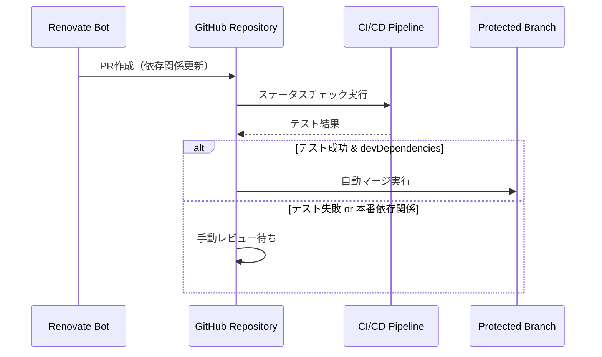
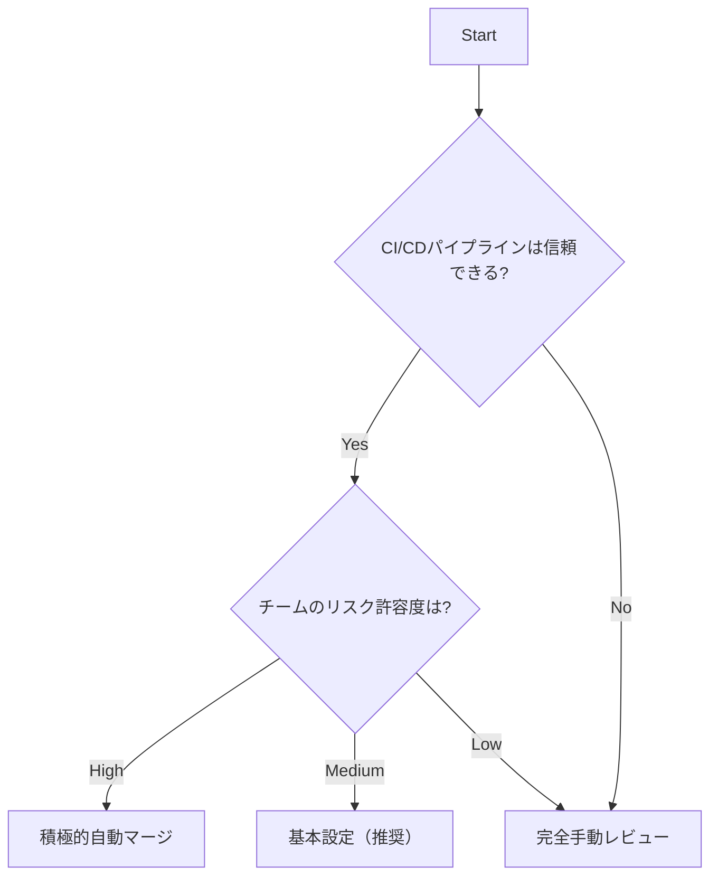

## Executive Summary

このドキュメントでは、Renovate による依存パッケージの自動更新と、GitHub リポジトリでの自動マージを実現するための設定方法を説明します。推奨アプローチは、`config:recommended`をベースとした基本設定に、開発依存関係の自動マージを組み合わせることです。

**Target Audience**: プロジェクト管理者、DevOps エンジニア、および依存関係管理の自動化を実装するAI Agent

## Prerequisites

### Required Knowledge

To fully understand and implement the recommendations in this document:

- **Core Technologies**:
  - GitHub: ブランチ保護ルール、ステータスチェック、PR管理
  - JSON: 設定ファイルの記述
- **Programming Languages**:
  - JSON: Renovate設定ファイルの構文理解
- **Frameworks & Tools**:
  - Renovate: 依存関係自動更新ツールの基本概念
  - GitHub Actions: CI/CDワークフローの基本理解（ステータスチェック用）

## Problem Statement

### Context

プロジェクトの依存関係を手動で管理することは、セキュリティアップデートの見落としや開発効率の低下を招く可能性があります。Renovateによる自動化を導入することで、安全で効率的な依存関係管理を実現する必要があります。

### Requirements

- 依存パッケージの自動検出と更新
- 開発依存関係の安全な自動マージ
- テスト失敗時の自動マージ回避
- 更新頻度とPR作成数の適切な制御
- GitHub ブランチ保護ルールとの連携

### Success Criteria

- 開発依存関係が自動的に更新・マージされる
- テストが通った場合のみ自動マージが実行される
- 本番依存関係は手動レビューが必要な状態を維持

## Research Methodology

### Information Sources

- **Web Search**: "renovate automerge configuration", "github branch protection renovate bot"
- **Documentation Review**: Renovate公式ドキュメント、GitHub公式ドキュメント
- **Community Insights**: GitHub Issues、実装事例の調査
- **Code Analysis**: 既存プロジェクトのrenovate.json設定パターン

### Evaluation Criteria

1. **Technical Fit**: GitHubワークフローとの統合性
2. **Performance**: PR作成頻度と処理速度
3. **Developer Experience**: 設定の複雑さ、メンテナンス性
4. **Maintenance**: 長期的な保守性、アップデート追従性
5. **Security**: セキュリティアップデートの適切な処理

## Options Analysis

### Option 1: 基本設定（推奨ベース）

**Overview**
`config:recommended`を基盤とし、開発依存関係のみ自動マージを有効にする安全重視のアプローチ。

**Key Features**

- Renovateの推奨設定をベースとする
- 開発依存関係の自動マージ
- 本番依存関係は手動レビュー
- 適切なPR作成頻度制御

**Implementation Example**

```json
{
  "$schema": "https://docs.renovatebot.com/renovate-schema.json",
  "extends": ["config:recommended"],
  "packageRules": [
    {
      "matchDepTypes": ["devDependencies"],
      "automerge": true
    }
  ]
}
```

**Pros**

- 安全性が高い（本番依存関係は手動確認）
- 設定がシンプル
- Renovateのベストプラクティスに準拠
- 段階的導入が可能

**Cons**

- 本番依存関係の更新に手動作業が必要
- 初期設定でも一部手動対応が発生

**Metrics**

- **設定複雑度**: Low
- **自動化レベル**: Medium
- **安全性**: High
- **メンテナンス負荷**: Low

### Option 2: 積極的自動マージ

**Overview**
セキュリティアップデート以外の全ての依存関係を自動マージする攻撃的なアプローチ。

**Key Features**

- 広範囲の自動マージ
- 迅速な依存関係更新
- CI/CDテストへの高い信頼
- 最小限の手動介入

**Implementation Example**

```json
{
  "$schema": "https://docs.renovatebot.com/renovate-schema.json",
  "extends": ["config:recommended"],
  "packageRules": [
    {
      "matchUpdateTypes": ["minor", "patch"],
      "automerge": true
    }
  ]
}
```

**Pros**

- 高い自動化レベル
- 迅速な依存関係更新
- 手動作業の最小化

**Cons**

- 予期しない破壊的変更のリスク
- テストスイートへの高い依存
- デバッグが困難になる可能性

**Metrics**

- **設定複雑度**: Medium
- **自動化レベル**: High
- **安全性**: Medium
- **メンテナンス負荷**: Very Low

### Option 3: 完全手動レビュー

**Overview**
全ての依存関係更新を手動レビューで管理する保守的なアプローチ。

**Key Features**

- 全更新の手動確認
- 最大限の制御
- リスク最小化
- 詳細な変更レビュー

**Implementation Example**

```json
{
  "$schema": "https://docs.renovatebot.com/renovate-schema.json",
  "extends": ["config:recommended"],
  "automerge": false
}
```

**Pros**

- 最高レベルの安全性
- 全変更の把握が可能
- 予期しない変更の完全回避

**Cons**

- 高い手動負荷
- セキュリティ更新の遅延リスク
- スケーラビリティの欠如

**Metrics**

- **設定複雑度**: Low
- **自動化レベル**: Low
- **安全性**: Very High
- **メンテナンス負荷**: High

## Comparison Matrix

| Criteria          | 基本設定（推奨） | 積極的自動マージ | 完全手動レビュー |
| ----------------- | ---------------- | ---------------- | ---------------- |
| Technical Fit     | High             | Medium           | High             |
| Performance       | Good             | Excellent        | Poor             |
| Learning Curve    | Low              | Medium           | Low              |
| Community Support | Active           | Active           | Active           |
| Documentation     | Excellent        | Good             | Excellent        |
| Type Safety       | High             | Medium           | Very High        |
| Bundle Size       | N/A              | N/A              | N/A              |
| Maintenance Risk  | Low              | Medium           | Very Low         |

## Implementation Patterns

### Pattern A: GitHub ブランチ保護ルール連携

#### Data Flow



#### Implementation

```json
{
  "$schema": "https://docs.renovatebot.com/renovate-schema.json",
  "extends": ["config:recommended"],
  "packageRules": [
    {
      "matchDepTypes": ["devDependencies"],
      "automerge": true
    }
  ],
  "assignAutomerge": true,
  "schedule": ["every weekend"],
  "labels": ["dependencies", "renovate"],
  "prHourlyLimit": 5
}
```

**When to use**:

- 適度な自動化と安全性のバランスが必要
- 開発チームのレビュー負荷を軽減したい
- CI/CDパイプラインが信頼できる

**Best Practices**:

- GitHub側でブランチ保護ルール設定
- 必須ステータスチェックの設定
- Renovate Botのバイパス権限付与

### Pattern B: スケジュール制御と通知設定

#### Implementation

```json
{
  "schedule": ["every weekend"],
  "timezone": "Asia/Tokyo",
  "assignAutomerge": true,
  "reviewers": ["@team/developers"],
  "labels": ["dependencies", "renovate", "automerge"]
}
```

**When to use**:

- 平日の開発作業への影響を避けたい
- チーム全体への通知が必要
- 定期的なレビューサイクルを設けたい

**Best Practices**:

- 適切なタイムゾーン設定
- チームレビュアーの指定
- ラベルによる分類管理

## Decision Flow



## Recommendations

### Primary Recommendation

**基本設定（config:recommended + devDependencies自動マージ）**

バランスの取れたアプローチとして、Renovateの推奨設定をベースに開発依存関係のみ自動マージを有効にする設定を推奨します。これにより安全性を保ちながら効率的な依存関係管理を実現できます。

### Technologies to Use

**IMPORTANT: These are the ONLY technologies that should be used for this implementation**

#### Core Configuration

- **Renovate設定ファイル**
  - ファイル名: `renovate.json`
  - 配置場所: プロジェクトルートディレクトリ
  - 基本設定: `config:recommended`
  - 目的: 依存関係自動更新の制御

#### Supporting Configuration

- **GitHub ブランチ保護ルール**
  - 設定項目: Require status checks, Allow bypass for Renovate Bot
  - 目的: 自動マージ時の安全性確保
  - 必須設定: 少なくとも1つのステータスチェックを必須

#### Monitoring Tools

- **GitHub通知設定**: PR作成とマージの通知管理
- **ラベル管理**: dependencies, renovateラベルによる分類

### Technologies NOT to Use

**CRITICAL: Do NOT use these technologies under any circumstances**

- **ブランチ保護なしの全自動マージ**
  - Reason: テスト失敗時でもマージされるリスク
  - Alternative: 必須ステータスチェック付きの設定を使用

- **過度に頻繁なPR作成**
  - Reason: 開発チームの作業負荷増大
  - Alternative: `prHourlyLimit`とスケジュール制御を使用

### Alternative Scenarios

- **If 高リスク許容環境**: 積極的自動マージパターンを検討
- **If 極めて保守的な環境**: 完全手動レビューパターンを検討

## References

External references:

- [Renovate 公式ドキュメント](https://docs.renovatebot.com/)
- [Automerge設定ガイド](https://docs.renovatebot.com/key-concepts/automerge/)
- [GitHub ブランチ保護ルール公式ドキュメント](https://docs.github.com/ja/repositories/configuring-branches-and-merges-in-your-repository/managing-protected-branches/about-protected-branches)

## Appendix

### Search Queries Used

```
「Renovate 自動マージ GitHub ブランチ保護ルール 最新設定 2025」
「Renovate automerge GitHub branch protection bypass configuration latest」
「renovate.json devDependencies automerge best practices」
```

### Additional Notes

このドキュメントは2025年5月の情報に基づいて作成されています。Renovate や GitHub の仕様変更により内容が古くなる可能性があるため、実装前に最新の公式ドキュメントを確認してください。自動マージには最大2時間程度の処理時間が必要な場合があります。
