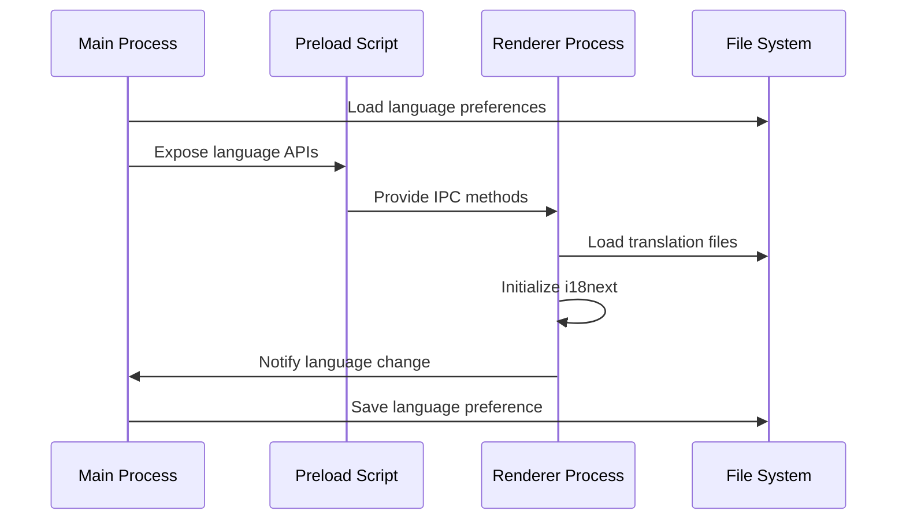
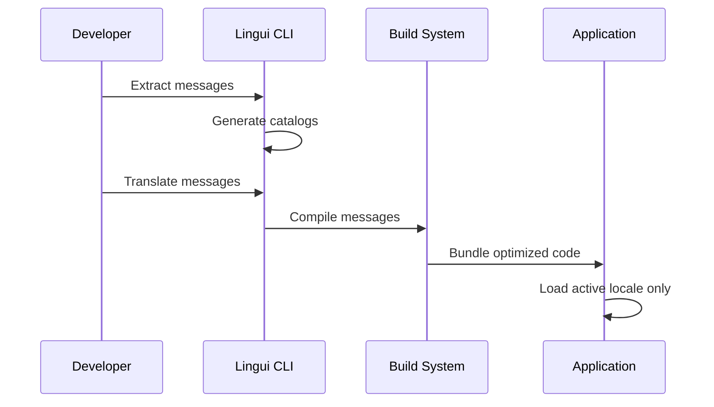
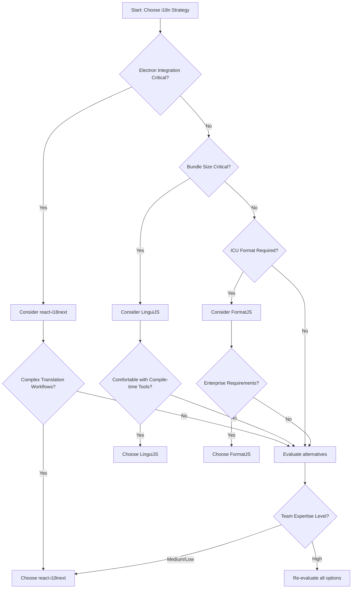

## Executive Summary

This research evaluates comprehensive internationalization (i18n) strategies for our Electron application built with React, TypeScript, and electron-vite. After analyzing three major i18n libraries (react-i18next, FormatJS/react-intl, and LinguiJS), **react-i18next emerges as the recommended solution** due to its robust Electron integration, excellent TypeScript support, and comprehensive ecosystem including electron-specific backends.

**Target Audience**: Electron developers, React developers, internationalization implementers

## Prerequisites

### Required Knowledge

To fully understand and implement the recommendations in this document:

- **Core Technologies**:
  - **Electron**: Understanding of main process, renderer process, and preload script architecture
  - **React 19**: Modern React with hooks, concurrent features, and component lifecycle
  - **TypeScript**: Interface definitions, type safety, and module systems
- **Programming Languages**:
  - TypeScript: Intermediate level (interfaces, generics, module augmentation)
  - JavaScript: ES2020+ features including async/await and dynamic imports

- **Frameworks & Tools**:
  - **electron-vite**: Build configuration and process-specific bundling
  - **Vite**: Asset handling and development server capabilities
  - **pnpm**: Package management and workspace handling

## Problem Statement

### Context

Our Electron application currently lacks internationalization support, limiting its accessibility to global users. The application uses electron-vite with React 19 and TypeScript, requiring an i18n solution that:

1. Works seamlessly across Electron's multi-process architecture (main, renderer, preload)
2. Integrates with our existing electron-vite build system
3. Provides excellent TypeScript support with type-safe translations
4. Supports dynamic language switching without application restart
5. Handles system locale detection and user preference persistence

### Requirements

- **Cross-process compatibility**: Support for both main and renderer processes
- **TypeScript integration**: Full type safety for translation keys and interpolation
- **Performance**: Minimal bundle size impact and efficient loading
- **Developer experience**: Easy key extraction, IDE support, and workflow integration
- **Localization features**: Pluralization, number/date formatting, RTL support
- **Maintainability**: Clear file organization and translation management

### Success Criteria

- Implementation enables multi-language support with < 50KB bundle size impact
- Type-safe translation usage throughout the application
- Seamless language switching with < 100ms response time
- Clear developer workflow for adding new translations

## Research Methodology

### Information Sources

- **Web Documentation Review**: Official documentation for react-i18next, FormatJS, and LinguiJS
- **Package Analysis**: NPM registry data for bundle sizes, download statistics, and maintenance status
- **Community Insights**: GitHub repositories, issue tracking, and community adoption patterns
- **Technical Integration**: electron-vite compatibility and build process considerations

### Evaluation Criteria

1. **Technical Fit**: Compatibility with Electron multi-process architecture and electron-vite
2. **Performance**: Bundle size, loading efficiency, and runtime performance
3. **Developer Experience**: TypeScript integration, tooling support, and ease of implementation
4. **Maintenance**: Community activity, update frequency, and long-term viability
5. **Security**: Security track record and vulnerability management

## Options Analysis

### Option 1: react-i18next

**Overview**
The most popular React internationalization library, built on the robust i18next ecosystem with dedicated Electron support through specialized backends.

**Key Features**

- Hook-based React integration (useTranslation, useTranslation)
- Dedicated Electron filesystem backend (i18next-electron-fs-backend)
- Namespace and lazy loading support
- Rich interpolation and pluralization
- Built-in language detection
- Strong TypeScript support with type generation

**Implementation Example**

```typescript
// src/renderer/src/i18n/index.ts
import i18n from 'i18next'
import { initReactI18next } from 'react-i18next'
import Backend from 'i18next-electron-fs-backend'
import LanguageDetector from 'i18next-electron-languagedetector'

i18n
  .use(Backend)
  .use(LanguageDetector)
  .use(initReactI18next)
  .init({
    fallbackLng: 'en',
    debug: process.env.NODE_ENV === 'development',

    backend: {
      loadPath: '{{lng}}/{{ns}}.json',
      addPath: '{{lng}}/{{ns}}.missing.json'
    },

    interpolation: {
      escapeValue: false
    },

    react: {
      suspense: true
    }
  })

export default i18n
```

```typescript
// Component usage with TypeScript
import { useTranslation } from 'react-i18next';

interface ComponentProps {
  userCount: number;
}

function WelcomeMessage({ userCount }: ComponentProps) {
  const { t } = useTranslation('common');

  return (
    <div>
      <h1>{t('welcome.title')}</h1>
      <p>{t('welcome.userCount', { count: userCount })}</p>
    </div>
  );
}
```

**Pros**

- **Electron-native**: Dedicated backends for Electron filesystem access
- **Mature ecosystem**: 7+ years of active development, 5.7M weekly downloads
- **Comprehensive features**: Namespace, lazy loading, pluralization, interpolation
- **Strong TypeScript support**: Built-in types and community type generators
- **Excellent documentation**: Comprehensive guides and examples
- **Language detection**: Automatic system locale detection for Electron
- **IPC integration**: Easy sharing of language state between processes

**Cons**

- **Larger bundle size**: Core library ~15KB + React bindings ~8KB
- **Configuration complexity**: Many options can overwhelm simple use cases
- **Learning curve**: Rich feature set requires investment to understand fully

**Metrics**

- **NPM Weekly Downloads**: 5,728,639
- **GitHub Stars**: ~9,000
- **Last Updated**: 17 days ago
- **TypeScript Support**: Native TypeScript declarations
- **Bundle Size**: ~23KB (core + react bindings)

### Option 2: FormatJS (react-intl)

**Overview**
A standards-based internationalization library focusing on ICU MessageFormat with strong formatting capabilities and compile-time optimizations.

**Key Features**

- ICU MessageFormat standard compliance
- Compile-time message extraction and optimization
- Rich formatting for dates, numbers, and currencies
- Message descriptor TypeScript generation
- React component and hook APIs
- Built-in pluralization support

**Implementation Example**

```typescript
// src/renderer/src/i18n/index.ts
import { createIntl, createIntlCache } from '@formatjs/intl'

const cache = createIntlCache()
const intl = createIntl(
  {
    locale: 'en',
    messages: {
      'welcome.title': 'Welcome to our application',
      'welcome.userCount': '{count, plural, =0 {No users} =1 {One user} other {# users}}'
    }
  },
  cache
)

export default intl
```

```typescript
// Component usage
import { FormattedMessage, useIntl } from 'react-intl';

function WelcomeMessage({ userCount }: { userCount: number }) {
  const intl = useIntl();

  return (
    <div>
      <h1>
        <FormattedMessage id="welcome.title" />
      </h1>
      <p>
        <FormattedMessage
          id="welcome.userCount"
          values={{ count: userCount }}
        />
      </p>
    </div>
  );
}
```

**Pros**

- **Standards compliance**: Full ICU MessageFormat support
- **Compile-time optimization**: Build-time message extraction and tree-shaking
- **Rich formatting**: Excellent date, number, and currency formatting
- **TypeScript integration**: Generated type definitions from message descriptors
- **Performance**: Optimized runtime with caching
- **Enterprise support**: Backed by major companies, used by Facebook/Meta

**Cons**

- **Electron integration**: No dedicated Electron backends or filesystem integration
- **Complex setup**: Requires build-time tooling for optimization
- **Limited flexibility**: More opinionated approach limits customization
- **Learning curve**: ICU MessageFormat syntax can be complex

**Metrics**

- **NPM Weekly Downloads**: 1,723,655 (@formatjs/intl)
- **GitHub Stars**: ~14,000
- **Last Updated**: 4 months ago
- **TypeScript Support**: Full TypeScript with generated types
- **Bundle Size**: ~12KB (core formatting)

### Option 3: LinguiJS

**Overview**
A modern, lightweight internationalization framework with compile-time optimizations, minimal runtime overhead, and excellent developer experience.

**Key Features**

- Ultra-lightweight runtime (~2KB core + 1.4KB React components)
- Compile-time message extraction and optimization
- ICU MessageFormat support with clean JSX syntax
- TypeScript-first development approach
- CLI tools for message management
- Compatible with react-intl message format

**Implementation Example**

```typescript
// lingui.config.js
module.exports = {
  locales: ['en', 'es', 'fr'],
  sourceLocale: 'en',
  catalogs: [
    {
      path: 'src/locales/{locale}/messages',
      include: ['src/'],
      exclude: ['**/node_modules/**']
    }
  ],
  format: 'po'
}
```

```typescript
// Component usage
import { Trans, t } from '@lingui/macro';
import { useLingui } from '@lingui/react';

function WelcomeMessage({ userCount }: { userCount: number }) {
  const { i18n } = useLingui();

  return (
    <div>
      <h1>
        <Trans id="welcome.title">Welcome to our application</Trans>
      </h1>
      <p>
        <Trans id="welcome.userCount" count={userCount}>
          {userCount} {userCount === 1 ? 'user' : 'users'} online
        </Trans>
      </p>
    </div>
  );
}
```

**Pros**

- **Minimal bundle size**: Only ~3.4KB total runtime footprint
- **Compile-time optimization**: Messages compiled away, only active locale included
- **Clean syntax**: Natural JSX integration with intuitive APIs
- **TypeScript-first**: Built with TypeScript, excellent type safety
- **Modern tooling**: Comprehensive CLI and build tool integration
- **Performance**: Minimal runtime overhead due to compile-time processing

**Cons**

- **Electron compatibility**: No specific Electron integrations or backends
- **Build complexity**: Requires Babel macro setup and compile-time tooling
- **Smaller ecosystem**: Fewer plugins and extensions compared to i18next
- **Documentation gaps**: Less comprehensive documentation for advanced use cases
- **Community size**: Smaller community (265K weekly downloads vs 5.7M for react-i18next)

**Metrics**

- **NPM Weekly Downloads**: 265,492
- **GitHub Stars**: ~4,500
- **Last Updated**: 7 days ago
- **TypeScript Support**: Native TypeScript, 90.1% TypeScript codebase
- **Bundle Size**: ~3.4KB total (2KB core + 1.4KB React)

## Comparison Matrix

| Criteria             | react-i18next                | FormatJS/react-intl         | LinguiJS                    |
| -------------------- | ---------------------------- | --------------------------- | --------------------------- |
| Technical Fit        | Excellent (Electron-native)  | Good (requires adaptation)  | Good (requires adaptation)  |
| Performance          | ~23KB bundle size            | ~12KB bundle size           | ~3.4KB bundle size          |
| Learning Curve       | Medium                       | High (ICU complexity)       | Low (intuitive JSX)         |
| Community Support    | Very Active (5.7M downloads) | Active (1.7M downloads)     | Growing (265K downloads)    |
| Documentation        | Excellent                    | Good                        | Good                        |
| Type Safety          | Full with code generation    | Full with generated types   | Native TypeScript           |
| Bundle Size          | Large                        | Medium                      | Minimal                     |
| Maintenance Risk     | Low (mature, active)         | Low (enterprise-backed)     | Medium (smaller community)  |
| Electron Support     | Native (dedicated backends)  | Manual integration required | Manual integration required |
| Developer Experience | Good (rich ecosystem)        | Complex (build tooling)     | Excellent (clean APIs)      |

## Implementation Patterns

### Pattern A: Multi-Process i18n with react-i18next

#### Data Flow



#### Implementation

```typescript
// src/main/i18n/index.ts - Main process
import { app } from 'electron'
import Store from 'electron-store'

interface I18nStore {
  language: string
}

const store = new Store<I18nStore>({
  defaults: {
    language: app.getLocale()
  }
})

export function getStoredLanguage(): string {
  return store.get('language')
}

export function setStoredLanguage(language: string): void {
  store.set('language', language)
}

// src/preload/index.ts - Preload script
import { contextBridge, ipcRenderer } from 'electron'
import { electronAPI } from '@electron-toolkit/preload'

const i18nAPI = {
  getLanguage: () => ipcRenderer.invoke('i18n:get-language'),
  setLanguage: (language: string) => ipcRenderer.invoke('i18n:set-language', language),
  onLanguageChanged: (callback: (language: string) => void) =>
    ipcRenderer.on('i18n:language-changed', (_, language) => callback(language))
}

contextBridge.exposeInMainWorld('i18n', i18nAPI)

// src/renderer/src/i18n/index.ts - Renderer process
import i18n from 'i18next'
import { initReactI18next } from 'react-i18next'
import Backend from 'i18next-electron-fs-backend'

i18n
  .use(Backend)
  .use(initReactI18next)
  .init({
    lng: await window.i18n.getLanguage(),
    fallbackLng: 'en',

    backend: {
      loadPath: path.join(__dirname, '../locales/{{lng}}/{{ns}}.json'),
      addPath: path.join(__dirname, '../locales/{{lng}}/{{ns}}.missing.json')
    },

    interpolation: {
      escapeValue: false
    }
  })

// Listen for language changes from main process
window.i18n.onLanguageChanged((language) => {
  i18n.changeLanguage(language)
})

export default i18n
```

**When to use**:

- Applications requiring cross-process language synchronization
- Complex translation workflows with namespace management
- Applications with both UI and system-level internationalization needs

**Best Practices**:

- Store language preference in electron-store for persistence
- Use IPC for coordinating language changes between processes
- Implement fallback language loading for graceful degradation
- Error handling: Implement robust error handling for missing translation files and IPC failures

### Pattern B: Compile-time Optimization with LinguiJS

#### Data Flow



#### Implementation

```typescript
// babel.config.js
module.exports = {
  presets: ['@babel/preset-env', '@babel/preset-react', '@babel/preset-typescript'],
  plugins: ['macros']
}

// lingui.config.js
module.exports = {
  locales: ['en', 'es', 'fr', 'de', 'ja'],
  sourceLocale: 'en',
  catalogs: [
    {
      path: 'src/renderer/src/locales/{locale}/messages',
      include: ['src/renderer/src/'],
      exclude: ['**/node_modules/**']
    }
  ],
  format: 'json'
}

// src/renderer/src/i18n/index.ts
import { i18n } from '@lingui/core'
import { detect, fromStorage } from '@lingui/detect-locale'

// Dynamic locale loading for Electron
export async function loadLocale(locale: string) {
  const { messages } = await import(`../locales/${locale}/messages.json`)
  i18n.load(locale, messages)
  i18n.activate(locale)

  // Store preference in Electron
  localStorage.setItem('language', locale)
}

// Detect and initialize locale
const detectedLocale = detect(fromStorage('language'), () => window.electron?.getLocale?.() || 'en')

loadLocale(detectedLocale)
```

**When to use**:

- Bundle size is critical concern
- Simple translation requirements without complex workflows
- Development teams comfortable with compile-time tooling

**Best Practices**:

- Use dynamic imports for lazy locale loading
- Implement locale detection with Electron system integration
- Set up automated message extraction in development workflow
- Error handling: Gracefully handle missing locale files with fallback loading

## Decision Flow



## Recommendations

### Primary Recommendation

**react-i18next with Electron-specific Configuration**

Based on our evaluation, react-i18next is the optimal choice for our Electron-vite React TypeScript application due to its native Electron support, mature ecosystem, and excellent TypeScript integration.

### Technologies to Use

**IMPORTANT: These are the ONLY technologies that should be used for this implementation**

#### Core Libraries

- **`react-i18next`**
  - npm package: `react-i18next`
  - Version: ^15.6.1 or latest
  - Installation: `pnpm add react-i18next i18next`
  - Purpose: Primary React internationalization library with hooks support
  - Selection reason: Native Electron support, mature ecosystem, excellent TypeScript integration

- **`i18next-electron-fs-backend`**
  - npm package: `i18next-electron-fs-backend`
  - Version: ^3.0.0 or latest
  - Installation: `pnpm add i18next-electron-fs-backend`
  - Purpose: Electron-specific backend for loading translations from filesystem
  - Selection reason: Designed specifically for Electron's security constraints and process architecture

- **`i18next-electron-languagedetector`**
  - npm package: `i18next-electron-languagedetector`
  - Version: ^0.0.10 or latest
  - Installation: `pnpm add i18next-electron-languagedetector`
  - Purpose: Automatic language detection using Electron's `app.getLocale()`
  - Selection reason: Seamless integration with Electron's system locale detection

#### Supporting Libraries

- **`electron-store`**
  - npm package: `electron-store`
  - Version: ^10.0.0 or latest
  - Purpose: Persistent storage for user language preferences
  - Selection reason: Secure, type-safe storage that works across Electron processes

- **`@types/i18next`**
  - npm package: `@types/i18next`
  - Version: Latest compatible with i18next version
  - Purpose: TypeScript type definitions and type safety for translation keys
  - Selection reason: Enables compile-time type checking for translation usage

#### Development Tools

- **i18next-parser**: CLI tool for extracting translation keys from source code
- **TypeScript Integration**: Custom type generation for translation key validation
- **Vite Plugin**: Integration with electron-vite for proper asset handling

### Technologies NOT to Use

**CRITICAL: Do NOT use these technologies under any circumstances**

- **`i18next-http-backend`**
  - Reason: Designed for web applications, incompatible with Electron's file system security model
  - Common mistake: Often suggested in general React i18n tutorials
  - Alternative: Use `i18next-electron-fs-backend` instead

- **`react-intl` without proper Electron integration**
  - Reason: Requires additional tooling to work with Electron's process architecture
  - Alternative: Use react-i18next with dedicated Electron backends

- **`i18next-browser-languagedetector`**
  - Reason: Designed for browsers, will not work in Electron's main process
  - Alternative: Use `i18next-electron-languagedetector` instead

- **Direct file system access in renderer process**
  - Reason: Violates Electron security model and will fail with contextIsolation enabled
  - Note: Always use IPC or specialized backends for file access

### Alternative Scenarios

- **If bundle size is absolutely critical (< 10KB total)**: Consider LinguiJS with compile-time optimization, but accept reduced Electron integration
- **If team has extensive ICU MessageFormat experience**: Consider FormatJS/react-intl with custom Electron integration layer
- **If simple string replacement is sufficient**: Consider a minimal custom solution, but lose advanced i18n features

## References

- react-i18next official documentation: https://react.i18next.com
- i18next Electron integration guide: https://www.i18next.com/how-to/add-or-load-translations#lazy-load-translations
- Electron security guidelines: https://www.electronjs.org/docs/tutorial/security
- TypeScript integration patterns: https://react.i18next.com/latest/typescript

## Appendix

### Search Queries Used

```
Electron app internationalization i18n React TypeScript 2025 best practices
electron-vite React i18n implementation guide 2025
i18next vs react-intl vs lingui Electron app comparison 2025
react-i18next TypeScript integration examples
Electron filesystem backend i18n loading patterns
```

### Package Comparison Data

| Package        | Weekly Downloads | Bundle Size | TypeScript Support | Last Updated |
| -------------- | ---------------- | ----------- | ------------------ | ------------ |
| react-i18next  | 5,728,639        | ~23KB       | Native             | 17 days ago  |
| @formatjs/intl | 1,723,655        | ~12KB       | Generated types    | 4 months ago |
| @lingui/react  | 265,492          | ~3.4KB      | Native             | 7 days ago   |

### Electron-vite Integration Notes

- Translation files should be placed in `src/renderer/public/locales/` for proper bundling
- Use dynamic imports for lazy loading in renderer process
- Configure Vite to handle JSON translation files as assets
- Ensure proper path resolution for both development and production builds
