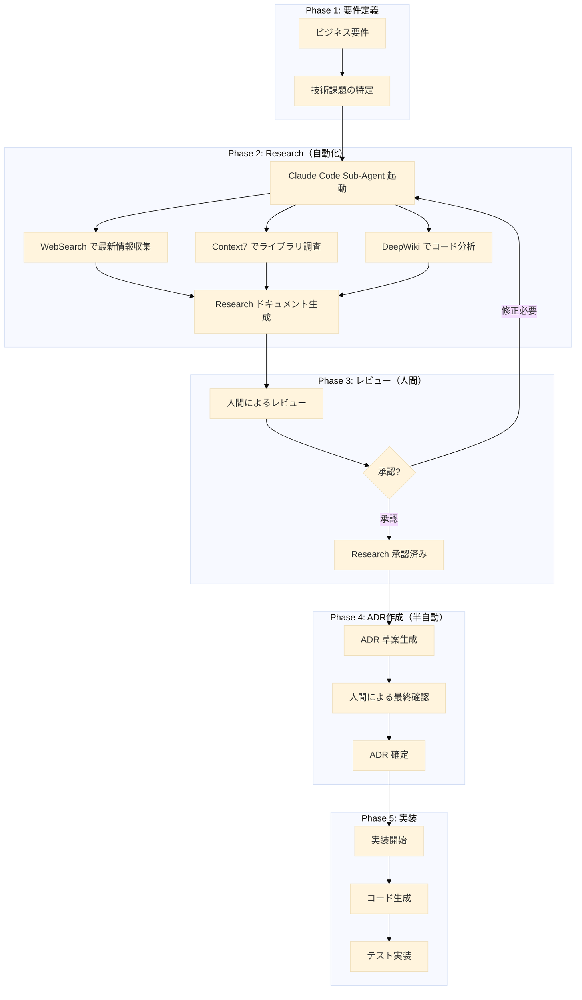

# Research-ADR システム設計書

status: in progress

## 背景

現代のソフトウェア開発において、技術選定は複雑化の一途をたどっている。特に Electron アプリケーション開発では、適切な技術選定が困難になっている。

npm には同じ目的を達成する複数のライブラリが存在し、それぞれに長所と短所がある。最新のベストプラクティス情報は GitHub、ブログ、公式ドキュメントなど複数の場所に散在しており、開発者は情報収集に多くの時間を費やさなければならない。さらに、JavaScript/TypeScript エコシステムは急速に進化し、昨日のベストプラクティスが今日は非推奨になることもある。このような環境において、なぜその技術を選んだのか、どの代替案を検討したのかが時間とともに忘れられ、技術的決定の追跡が困難になっている。

これらの問題により、開発チームは技術調査に膨大な時間を費やし、重要な技術的決定の根拠が不明確になるという課題に直面している。同じような調査を繰り返し実施することも多く、新規メンバーへの知識伝達も困難になっている。

## 課題

### 1. 技術調査の非効率性

- **手動での情報収集**: 開発者が個別に Google 検索、GitHub 探索、ドキュメント読解を行う必要がある
- **比較検討の困難さ**: 複数のオプションを体系的に比較する標準的な方法がない
- **最新情報の欠如**: 古い情報や非推奨のプラクティスを参照してしまうリスク

### 2. 意思決定プロセスの不透明性

- **決定根拠の消失**: なぜその技術を選んだのかが記録されていない
- **代替案の検討不足**: 他のオプションがなぜ却下されたのか不明
- **影響評価の欠如**: 決定がもたらす長期的な影響が考慮されていない

### 3. 知識の属人化

- **個人の経験に依存**: 技術選定が特定の開発者の知識に依存
- **チーム間での共有不足**: 調査結果や決定事項が適切に共有されない
- **再利用性の低さ**: 過去の調査結果を次のプロジェクトで活用できない

## 解決策

### Research-ADR システムの導入

Claude Code の Sub-Agents 機能を活用し、技術調査（Research）からアーキテクチャ決定記録（ADR）までを体系的に管理するシステムを構築する。

### システムアーキテクチャ



### ワークフロー詳細

#### 1. Research フェーズ（技術調査）

**トリガー**: 開発者が Claude Code に技術要件を伝える

```bash
# 例: IPC 通信の型安全性を実現したい
"Electron の IPC 通信を型安全にする方法を調査してください"
```

**Claude Code の自動実行**:

1. **Sub-Agent の起動**
   - general-purpose agent を使用して複数の情報源を並列調査

2. **情報収集タスク**

   ```typescript
   interface ResearchTasks {
     webSearch: {
       queries: [
         'Electron IPC type safety 2024',
         'typed-ipc vs electron-trpc comparison',
         'Electron IPC best practices TypeScript'
       ]
     }
     context7: {
       libraries: ['typed-ipc', 'electron-trpc', 'electron-better-ipc']
     }
     deepWiki: {
       repositories: ['electron/electron', 'alex8088/electron-vite']
     }
   }
   ```

3. **Research ドキュメント生成**
   - テンプレート（@docs/architecture/\_templates/rfc.md）に基づいて自動生成
   - 実装パターンの比較マトリックス作成
   - パターン選択フローチャートの生成

**出力**: `docs/architecture/rfc/YYYY-MM-DD-{topic}.md`

#### 2. レビューフェーズ（人間による検証）

**プロセス**:

1. Research ドキュメントの内容確認
2. ビジネス要件との整合性チェック
3. 技術的実現可能性の評価
4. 必要に応じて追加調査の指示

**判断基準**:

- 情報の完全性（全ての重要なオプションが検討されているか）
- 評価の妥当性（メリット・デメリットが適切に評価されているか）
- 実装の現実性（チームのスキルセットで実装可能か）

#### 3. ADR 作成フェーズ（決定の文書化）

**自動生成される内容**:

```markdown
---
title: Use typed-ipc for Type-Safe IPC Communication
status: Proposed
updated: 2024-12-01
---

## Context

[Research から自動抽出]

## Decision

[Research の推奨パターンから生成]

## Consequences

[Research の評価マトリックスから変換]

## Alternatives

[Research で検討された他のオプション]

## References

- @docs/architecture/rfc/2024-12-01-ipc-type-safety.md
```

#### 4. 実装フェーズ（コード生成）

**Claude Code への指示例**:

```bash
"ADR-2024-12-01 に従って typed-ipc を実装してください"
```

**自動実行タスク**:

1. パッケージのインストール
2. 型定義の生成
3. IPC ハンドラーの実装
4. テストコードの作成

### ファイル構造

```text
docs/
├── architecture/
│   ├── README.md                 # アーキテクチャドキュメント概要
│   ├── _templates/               # テンプレート（アンダースコアで特別なディレクトリと明示）
│   │   ├── adr.md               # ADR テンプレート
│   │   └── rfc.md               # Research テンプレート
│   ├── adr/                      # ADR 格納ディレクトリ
│   │   ├── index.yaml           # ADR メタデータ管理
│   │   └── YYYY-MM-DD-*.md      # 個別 ADR
│   └── rfc/                      # Research 格納ディレクトリ
│       ├── index.yaml            # Research メタデータ管理
│       └── YYYY-MM-DD-*.md       # 個別 Research
└── research-adr-workflow.md       # このワークフローの使い方
```

### メタデータ管理

#### `docs/architecture/rfc/index.yaml`

```yaml
researches:
  - id: '2024-12-01-ipc-type-safety'
    title: 'Electron IPC 型安全性の実現方法'
    status: 'completed'
    created: '2024-12-01'
    adr_ref: '2024-12-01-typed-ipc-adoption'
    tags: ['ipc', 'type-safety', 'electron']
    summary: 'typed-ipc, electron-trpc, electron-better-ipc の比較検討'
```

#### `docs/architecture/adr/index.yaml`

```yaml
adrs:
  - id: '2024-12-01-typed-ipc-adoption'
    title: 'Use typed-ipc for Type-Safe IPC Communication'
    status: 'accepted'
    created: '2024-12-01'
    research_ref: '2024-12-01-ipc-type-safety'
    implementation:
      pr: '#123'
      status: 'completed'
      completed_date: '2024-12-02'
    superseded_by: null
```

### 期待される効果

1. **調査時間の短縮**
   - 手動調査: 4-8時間 → 自動調査: 30分-1時間
   - 並列処理による情報収集の高速化

2. **意思決定の質向上**
   - 体系的な比較検討による見落としの防止
   - 最新情報に基づいた判断

3. **知識の蓄積と共有**
   - すべての調査と決定が文書化される
   - 新規メンバーの立ち上がり時間短縮

4. **技術的負債の削減**
   - 決定の根拠が明確になることで、将来の見直しが容易
   - 代替案の記録により、状況変化時の再検討が効率的

### 導入ステップ

1. **Phase 1**: テンプレートとディレクトリ構造の整備（完了済み）
2. **Phase 2**: Claude Code での Research 自動生成の実践
3. **Phase 3**: ADR 作成プロセスの確立
4. **Phase 4**: メタデータ管理システムの構築
5. **Phase 5**: 過去の決定の遡及的文書化

### 成功指標（KPI）

- Research 作成時間: 従来比 75% 削減
- ADR カバレッジ: 重要な技術的決定の 100% を文書化
- 知識再利用率: Research の 60% 以上が複数プロジェクトで参照される
- 実装速度: ADR 確定から実装完了まで 50% 短縮

## References

- @docs/architecture/\_templates/rfc.md
- @docs/architecture/\_templates/adr.md
- [Claude Code Sub-Agents Documentation](https://docs.anthropic.com/en/docs/claude-code/sub-agents)
- [Architecture Decision Records](https://adr.github.io/)
